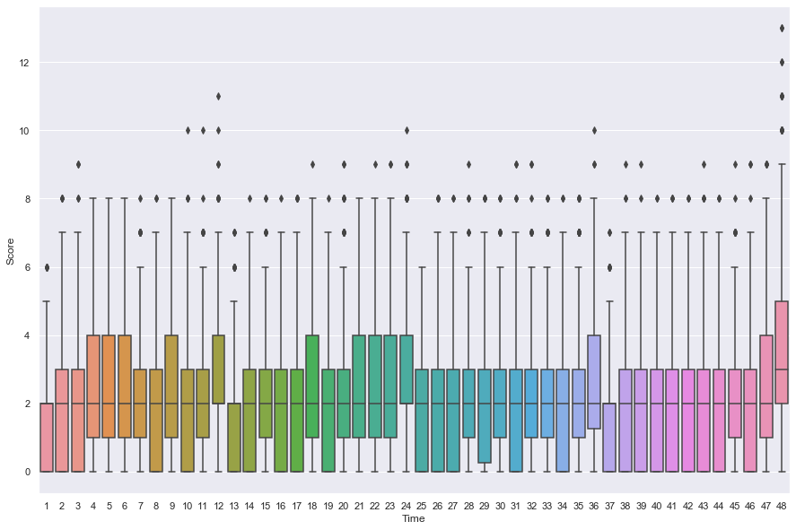
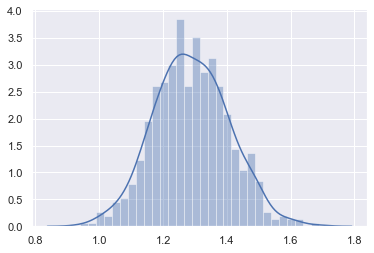
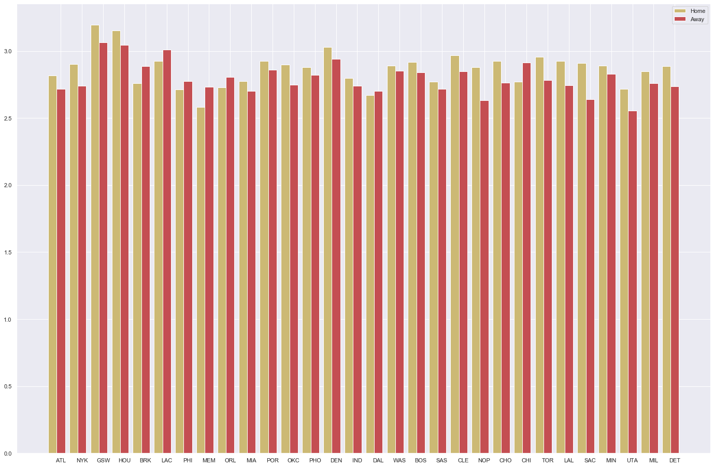

```python
#载入包
import numpy as np
import pandas as pd
import warnings
warnings.filterwarnings('ignore')
import matplotlib.pyplot as plt
import seaborn as sns
from random import randint
```

# 数据格式


```python
df = pd.read_csv('NBA-PBP_2016-2017.csv')
pd.options.display.max_columns = None
df.head()
```


<div>
<style scoped>
    .dataframe tbody tr th:only-of-type {
        vertical-align: middle;
    }

    .dataframe tbody tr th {
        vertical-align: top;
    }

    .dataframe thead th {
        text-align: right;
    }
</style>
<table border="1" class="dataframe">
  <thead>
    <tr style="text-align: right;">
      <th></th>
      <th>URL</th>
      <th>GameType</th>
      <th>Location</th>
      <th>Date</th>
      <th>Time</th>
      <th>WinningTeam</th>
      <th>Quarter</th>
      <th>SecLeft</th>
      <th>AwayTeam</th>
      <th>AwayPlay</th>
      <th>AwayScore</th>
      <th>HomeTeam</th>
      <th>HomePlay</th>
      <th>HomeScore</th>
      <th>Shooter</th>
      <th>ShotType</th>
      <th>ShotOutcome</th>
      <th>ShotDist</th>
      <th>Assister</th>
      <th>Blocker</th>
      <th>FoulType</th>
      <th>Fouler</th>
      <th>Fouled</th>
      <th>Rebounder</th>
      <th>ReboundType</th>
      <th>ViolationPlayer</th>
      <th>ViolationType</th>
      <th>TimeoutTeam</th>
      <th>FreeThrowShooter</th>
      <th>FreeThrowOutcome</th>
      <th>FreeThrowNum</th>
      <th>EnterGame</th>
      <th>LeaveGame</th>
      <th>TurnoverPlayer</th>
      <th>TurnoverType</th>
      <th>TurnoverCause</th>
      <th>TurnoverCauser</th>
      <th>JumpballAwayPlayer</th>
      <th>JumpballHomePlayer</th>
      <th>JumpballPoss</th>
    </tr>
  </thead>
  <tbody>
    <tr>
      <th>0</th>
      <td>/boxscores/201610250CLE.html</td>
      <td>regular</td>
      <td>Quicken Loans Arena Cleveland Ohio</td>
      <td>October 25 2016</td>
      <td>7:30 PM</td>
      <td>CLE</td>
      <td>1</td>
      <td>720</td>
      <td>NYK</td>
      <td>Jump ball: J. Noah vs. T. Thompson (D. Rose ga...</td>
      <td>0</td>
      <td>CLE</td>
      <td>NaN</td>
      <td>0</td>
      <td>NaN</td>
      <td>NaN</td>
      <td>NaN</td>
      <td>NaN</td>
      <td>NaN</td>
      <td>NaN</td>
      <td>NaN</td>
      <td>NaN</td>
      <td>NaN</td>
      <td>NaN</td>
      <td>NaN</td>
      <td>NaN</td>
      <td>NaN</td>
      <td>NaN</td>
      <td>NaN</td>
      <td>NaN</td>
      <td>NaN</td>
      <td>NaN</td>
      <td>NaN</td>
      <td>NaN</td>
      <td>NaN</td>
      <td>NaN</td>
      <td>NaN</td>
      <td>J. Noah - NYK</td>
      <td>T. Thompson - CLE</td>
      <td>D. Rose</td>
    </tr>
    <tr>
      <th>1</th>
      <td>/boxscores/201610250CLE.html</td>
      <td>regular</td>
      <td>Quicken Loans Arena Cleveland Ohio</td>
      <td>October 25 2016</td>
      <td>7:30 PM</td>
      <td>CLE</td>
      <td>1</td>
      <td>700</td>
      <td>NYK</td>
      <td>D. Rose makes 2-pt layup from 1 ft (assist by ...</td>
      <td>2</td>
      <td>CLE</td>
      <td>NaN</td>
      <td>0</td>
      <td>D. Rose - NYK</td>
      <td>2-pt layup</td>
      <td>make</td>
      <td>1.0</td>
      <td>J. Noah - NYK</td>
      <td>NaN</td>
      <td>NaN</td>
      <td>NaN</td>
      <td>NaN</td>
      <td>NaN</td>
      <td>NaN</td>
      <td>NaN</td>
      <td>NaN</td>
      <td>NaN</td>
      <td>NaN</td>
      <td>NaN</td>
      <td>NaN</td>
      <td>NaN</td>
      <td>NaN</td>
      <td>NaN</td>
      <td>NaN</td>
      <td>NaN</td>
      <td>NaN</td>
      <td>NaN</td>
      <td>NaN</td>
      <td>NaN</td>
    </tr>
    <tr>
      <th>2</th>
      <td>/boxscores/201610250CLE.html</td>
      <td>regular</td>
      <td>Quicken Loans Arena Cleveland Ohio</td>
      <td>October 25 2016</td>
      <td>7:30 PM</td>
      <td>CLE</td>
      <td>1</td>
      <td>686</td>
      <td>NYK</td>
      <td>NaN</td>
      <td>2</td>
      <td>CLE</td>
      <td>K. Love misses 2-pt hook shot from 4 ft</td>
      <td>0</td>
      <td>K. Love - CLE</td>
      <td>2-pt hook shot</td>
      <td>miss</td>
      <td>4.0</td>
      <td>NaN</td>
      <td>NaN</td>
      <td>NaN</td>
      <td>NaN</td>
      <td>NaN</td>
      <td>NaN</td>
      <td>NaN</td>
      <td>NaN</td>
      <td>NaN</td>
      <td>NaN</td>
      <td>NaN</td>
      <td>NaN</td>
      <td>NaN</td>
      <td>NaN</td>
      <td>NaN</td>
      <td>NaN</td>
      <td>NaN</td>
      <td>NaN</td>
      <td>NaN</td>
      <td>NaN</td>
      <td>NaN</td>
      <td>NaN</td>
    </tr>
    <tr>
      <th>3</th>
      <td>/boxscores/201610250CLE.html</td>
      <td>regular</td>
      <td>Quicken Loans Arena Cleveland Ohio</td>
      <td>October 25 2016</td>
      <td>7:30 PM</td>
      <td>CLE</td>
      <td>1</td>
      <td>683</td>
      <td>NYK</td>
      <td>Defensive rebound by J. Noah</td>
      <td>2</td>
      <td>CLE</td>
      <td>NaN</td>
      <td>0</td>
      <td>NaN</td>
      <td>NaN</td>
      <td>NaN</td>
      <td>NaN</td>
      <td>NaN</td>
      <td>NaN</td>
      <td>NaN</td>
      <td>NaN</td>
      <td>NaN</td>
      <td>J. Noah - NYK</td>
      <td>defensive</td>
      <td>NaN</td>
      <td>NaN</td>
      <td>NaN</td>
      <td>NaN</td>
      <td>NaN</td>
      <td>NaN</td>
      <td>NaN</td>
      <td>NaN</td>
      <td>NaN</td>
      <td>NaN</td>
      <td>NaN</td>
      <td>NaN</td>
      <td>NaN</td>
      <td>NaN</td>
      <td>NaN</td>
    </tr>
    <tr>
      <th>4</th>
      <td>/boxscores/201610250CLE.html</td>
      <td>regular</td>
      <td>Quicken Loans Arena Cleveland Ohio</td>
      <td>October 25 2016</td>
      <td>7:30 PM</td>
      <td>CLE</td>
      <td>1</td>
      <td>676</td>
      <td>NYK</td>
      <td>C. Anthony misses 2-pt jump shot from 20 ft</td>
      <td>2</td>
      <td>CLE</td>
      <td>NaN</td>
      <td>0</td>
      <td>C. Anthony - NYK</td>
      <td>2-pt jump shot</td>
      <td>miss</td>
      <td>20.0</td>
      <td>NaN</td>
      <td>NaN</td>
      <td>NaN</td>
      <td>NaN</td>
      <td>NaN</td>
      <td>NaN</td>
      <td>NaN</td>
      <td>NaN</td>
      <td>NaN</td>
      <td>NaN</td>
      <td>NaN</td>
      <td>NaN</td>
      <td>NaN</td>
      <td>NaN</td>
      <td>NaN</td>
      <td>NaN</td>
      <td>NaN</td>
      <td>NaN</td>
      <td>NaN</td>
      <td>NaN</td>
      <td>NaN</td>
      <td>NaN</td>
    </tr>
  </tbody>
</table>
</div>


# 模型简介
## 假设
每只队伍每分钟的得分服从gamma过程
## 参数
gamma过程有两个参数：alpha，beta
>alpha:代表球队得分能力  
>beta:代表比赛节奏     

## 参数估计
1. 每场比赛都可以估算出beta
2. 对beta进行参数估计，服从哪种ganmma过程
3. 对样本数据分主场和客场估计出每只队伍的主场alpha，客场alpha

## 模型评估
1. 预测主客队获胜胜率
2. 计算主客队胜负的似然函数

## 模型对比
**跟其他模型，按照相同的评估方式进行对比。**

## 跟历史赔率数据进行比较
⭐️⭐️⭐️如何比较待定⭐️⭐️⭐️

# 数据清洗


```python
#清洗play by play数据之后,生成分钟数据
game_num = df[df['GameType']=='regular']['URL'].value_counts()
df_match  = rand_match(df)
df_game = Match.data_process(df_match)
df_game.head()
```


<div>
<style scoped>
    .dataframe tbody tr th:only-of-type {
        vertical-align: middle;
    }

    .dataframe tbody tr th {
        vertical-align: top;
    }

    .dataframe thead th {
        text-align: right;
    }
</style>
<table border="1" class="dataframe">
  <thead>
    <tr style="text-align: right;">
      <th></th>
      <th>GameType</th>
      <th>WinningTeam</th>
      <th>Quarter</th>
      <th>SecLeft</th>
      <th>HomeTeam</th>
      <th>HomeScore</th>
      <th>AwayTeam</th>
      <th>AwayScore</th>
      <th>Istrue</th>
      <th>HomeMinScore</th>
      <th>AwayMinScore</th>
    </tr>
  </thead>
  <tbody>
    <tr>
      <th>578475</th>
      <td>regular</td>
      <td>IND</td>
      <td>1</td>
      <td>663</td>
      <td>MIN</td>
      <td>3</td>
      <td>IND</td>
      <td>2</td>
      <td>True</td>
      <td>3.0</td>
      <td>2.0</td>
    </tr>
    <tr>
      <th>578483</th>
      <td>regular</td>
      <td>IND</td>
      <td>1</td>
      <td>600</td>
      <td>MIN</td>
      <td>5</td>
      <td>IND</td>
      <td>2</td>
      <td>True</td>
      <td>2.0</td>
      <td>0.0</td>
    </tr>
    <tr>
      <th>578488</th>
      <td>regular</td>
      <td>IND</td>
      <td>1</td>
      <td>545</td>
      <td>MIN</td>
      <td>5</td>
      <td>IND</td>
      <td>2</td>
      <td>True</td>
      <td>0.0</td>
      <td>0.0</td>
    </tr>
    <tr>
      <th>578494</th>
      <td>regular</td>
      <td>IND</td>
      <td>1</td>
      <td>488</td>
      <td>MIN</td>
      <td>5</td>
      <td>IND</td>
      <td>2</td>
      <td>True</td>
      <td>0.0</td>
      <td>0.0</td>
    </tr>
    <tr>
      <th>578502</th>
      <td>regular</td>
      <td>IND</td>
      <td>1</td>
      <td>436</td>
      <td>MIN</td>
      <td>5</td>
      <td>IND</td>
      <td>4</td>
      <td>True</td>
      <td>0.0</td>
      <td>2.0</td>
    </tr>
  </tbody>
</table>
</div>


# 样本每分钟得分
⭐️⭐️⭐️改进方向⭐️⭐️⭐️   
通过观察，可以看到最后一分钟的得分，跟之前的得分不是一样的分布，模型却视为独立同分布


```python
sns.set(style="darkgrid")
plt.figure(figsize=(15, 10))
sns.boxplot(x="Time", y="Score",data = result)
```


    <matplotlib.axes._subplots.AxesSubplot at 0x1a1ead7d90>





# 参数估计

## lambda的分布


```python
lams = [1.2448064206720533, 1.4760489378767607, 1.176025492245957, 1.1024819361672367, 1.2428711656978555, 1.4883226797991798, 1.3015109017273392, 1.1827605164178276, 1.4205693023587942, 1.2119383113099513, 1.3704514785414936, 1.4424041583785563, 1.1897210743354165, 1.2973567435615732, 1.3190087427823212, 1.365952857716803, 1.0696321486093041, 1.1746271338243597, 1.300925090257413, 1.3048904111398896, 1.1403740002437823, 1.207422003230589, 1.3111777829241134, 1.3575318433814925, 1.1408323193163907, 1.322694072134527, 1.2123418373412462, 1.2198588767099356, 1.0804673719320328, 1.3276463035262234, 1.2141885966177381, 1.1859233470006436, 1.0993220264999284, 1.2179826597659345, 1.280051513025405, 1.2146002983768251, 1.1627333417139716, 1.3217196617160125, 1.3579840031215678, 1.25499122543024, 1.3486588298220117, 1.1666833735230937, 1.1551446014180282, 1.2332252887796944, 1.3053367008122827, 1.4153105875729128, 1.5093708803966561, 1.2027873179346815, 1.5035285587560738, 1.2425712551930943, 1.1863786071130225, 1.3747428620184263, 1.4079897361410225, 1.160020479886342, 1.319572149104014, 1.3045613903634847, 1.334243467619608, 1.1719384601467664, 1.3071342253343925, 1.2359984924492764, 1.1799468131572393, 1.2328837905416634, 1.4671726041989088, 1.443566880153858, 1.3664782361903034, 1.204484383301077, 1.1821328159555666, 1.3317464870630609, 1.3337897035824613, 1.2676764160430793, 1.287781837947017, 1.0903429824220223, 1.26405245369536, 1.3048302098704108, 1.1445111351064563, 1.1239235203740197, 1.1907110359648239, 1.1810504414740473, 1.297998868281371, 1.3781816265826934, 1.387048019181334, 1.0250641677479575, 1.088479859395319, 1.2340833288917095, 1.1263083989752376, 1.3299510874503633, 1.2338670433357968, 1.2795655925272333, 1.5766485243861315, 1.25257849800981, 1.4851210006726516, 1.2402003379401014, 1.247622385469524, 1.0783744575612366, 1.1869226732045863, 1.343666486887721, 1.3047936028356815, 1.3079388182141882, 1.4224816455005729, 1.3466147145967673, 1.2013485704729558, 1.2712761450990673, 1.3004050426343399, 1.343298749614727, 1.3461885848487687, 1.2289136282142503, 1.2258440120331207, 1.3111270209358628, 1.4818881258779588, 1.3357297831598385, 1.2152495378765367, 0.9403169452781233, 1.1794393411475124, 1.0415314626563628, 1.198538775423171, 1.2579576847531215, 1.1804549263710715, 1.1339360304180373, 1.4045689941952564, 1.3529674594737178, 1.3131908846948595, 1.3269470895779214, 1.2532161877127486, 1.2281719795136405, 1.3775894728302582, 1.4202980745030558, 1.3140822542431994, 1.2848678896237042, 1.3323874798097002, 1.1335852704210172, 1.295818901407624, 1.2850448415321927, 1.2502423882097158, 1.371368096061841, 1.3189750856982414, 1.2477624975996635, 1.2127687745063995, 1.4097729534906271, 1.4465596428030731, 1.2491216428235545, 1.385419731558391, 1.269663788162451, 1.1530368980178118, 1.2987547375820754, 1.6225610350399022, 1.3991338535758904, 1.2470236936993535, 1.4043546889275538, 1.382238663222201, 1.1463490367445996, 1.5651606349671554, 1.2428485895656742, 1.0888258350791595, 1.2268017308098011, 1.3975716704199221, 1.1544723708347306, 1.4071250594941853, 1.323609766179681, 1.473774321903743, 1.4241778055210552, 1.2674936683849891, 1.2273440237797184, 1.247811335681757, 1.2999548310364628, 1.6888739066870808, 1.1570511552071587, 1.298940491527911, 1.3644494594405998, 1.1563993733678926, 1.4613895099821703, 1.4253532179901374, 1.225133705117939, 1.388125874150084, 1.2233767220108267, 1.172451237510992, 1.063569991522586, 1.3547576197120672, 1.2443614344569958, 1.3049856963442308, 1.001499255846085, 1.590596880376003, 1.1548127982307257, 1.215561413516767, 1.3443016672806796, 1.4001585085515047, 1.1732521770969497, 1.3443599359153948, 1.3710539160688429, 1.405979913700989, 1.2421917998417915, 1.1557149803059237, 1.2606584222478263, 1.2904704526422464, 1.176988847920026, 1.1425991044885353, 1.2783329167785267, 1.253044505703225, 1.4564593074346122, 1.3521850043260537, 1.5258331617655903, 1.4146666180136447, 1.3653585720208001, 1.466886594888976, 1.2097754118378798, 1.1968549028453856, 1.337129883344542, 1.3577893255641365, 1.3540378746769473, 1.2138995676964537, 1.312438416362993, 1.3535331860782145, 1.2865664359812037, 1.3236645861426661, 1.432844781120021, 1.0772179776659654, 1.4444190086659507, 1.3889568425391496, 1.3564045753519505, 1.2169623950938822, 1.196368315793246, 1.2285196155275695, 1.2887577185124086, 1.126073388379496, 1.3444285502502593, 1.196423814345912, 1.3112259989727386, 1.423562084866361, 1.2713818022618462, 1.5041713752844044, 1.3866418143651718, 1.265213022420122, 1.257778729606553, 1.4208593611173193, 1.4452379274038203, 1.1523956428147992, 1.4135994047856952, 1.2754221692728693, 1.346871047355032, 1.3780386144848187, 1.2356854682603124, 1.0574511065121677, 1.3014601152707561, 1.21431555031752, 1.209448274186209, 1.191814101178725, 1.3119866756000045, 1.2825185363402838, 1.3074957102695022, 1.246013089005887, 1.2547674820074195, 1.266695936936737, 1.5105728233503195, 1.2548130482620994, 1.29487453485181, 1.3419195728122952, 1.34505453548182, 1.2637272515404425, 1.3238660247163607, 1.3513572864687247, 1.325902360843802, 1.136689613822305, 1.2236288447998016, 1.3891297090457462, 1.3780238260857705, 1.2287681278188896, 1.200193568095145, 1.3483797904198336, 1.4920984260200647, 1.3351619565345767, 1.3199615313009143, 1.4319986678581, 1.268140630773805, 1.0977022126722629, 1.3323209914634424, 1.4550227390450043, 1.3586728620191788, 1.4550154243904019, 1.0982001863550295, 1.2992884741927875, 1.1057336071837414, 1.3288131509524619, 1.4418011128983235, 1.5600393255745626, 1.228401956412765, 1.2793173775254703, 1.2157334112649383, 1.1849919960251278, 1.2616099987364895, 1.3685555179447073, 1.3554605279156764, 1.4714473051253476, 1.2022539156767962, 1.3909774547996843, 1.239581898673844, 1.4522578104430328, 1.3677195647790068, 1.4939736663613155, 1.1029174245158204, 1.3389749135216598, 1.354324996269318, 1.4354053262829929, 1.1104654929058966, 1.1445972123331063, 1.3843864962764556, 1.0208344425326246, 1.1778460534854602, 1.4083685291954642, 1.204448682480605, 1.2620988730686218, 1.4698046137688423, 1.2366461558489719, 1.2482655647084013, 1.534682267363075, 1.3578154967350193, 1.3799606074738084, 1.278282177931381, 1.2906383780369244, 1.2261368884964958, 1.2138987085618669, 1.1723010425459204, 1.3982058584409862, 1.243552269134585, 1.353464168846385, 1.4713730283526432, 1.4617284707380833, 1.3764550227954306, 1.2511070715960386, 1.330063476886845, 1.5069133371524537, 1.2512553503769372, 1.3388865867136568, 1.3781223015147144, 1.425027830774082, 1.1459306563700573, 1.3870970968691354, 1.2632769459973692, 1.3572169231467162, 1.1710186576005563, 1.3585207365296519, 1.1455474196318542, 1.2959507680413007, 1.3364285387162504, 1.2532958876155886, 1.2467332282581571, 1.1995109020338743, 1.4252762474119227, 1.2822729278701277, 1.3635503909342377, 1.3525132933696313, 1.0693884043364748, 1.205095714786807, 1.1763228638775987, 1.3092041741885176, 1.322558612568909, 1.4302491894036486, 1.3197361815106339, 1.2392898741972176, 1.1177847214306398, 1.256749547993499, 1.4810479879297511, 1.0469810256988765, 1.3257555594110473, 1.4233238077214665, 1.3382100358139102, 1.3055722558076817, 1.6060055247834581, 1.4756737884207602, 1.1250057403185751, 1.4133746496923703, 1.3614483063385383, 1.2123465918083758, 1.2804522602681334, 1.2819816393922223, 1.205231508156904, 1.0799749591396606, 1.050903145860116, 1.303189171533822, 1.3964285582149403, 1.2961389842646396, 1.5199777773636294, 1.3945115743480672, 1.1442285248651138, 1.359714701218217, 1.1309361699890808, 1.2351380761559723, 1.1818880331170871, 1.200863948950271, 1.3188239932243522, 1.355066148896301, 1.31763684290497, 1.2330630939713974, 1.192795225940632, 1.2707771797207275, 1.2573125585942366, 1.0100638752544238, 1.2761308945695076, 1.2013857500567018, 1.305428769310843, 1.200424669725445, 1.2545693515074066, 1.3723765719256344, 1.2492556516972484, 1.2559163981893375, 1.2753546712009962, 1.236254120248724, 1.2386789295530178, 1.5164832383890707, 1.204383112145761, 1.3513975642321474, 1.2995103535798331, 1.2977950969173273, 1.154524856492323, 1.5486042299223128, 1.387140271690111, 1.2773660397250766, 1.339306169479812, 1.2626797798028142, 1.377834839816566, 1.3867552781575814, 1.483724704449625, 1.1406266301021362, 1.3515198201953107, 1.3877107639658628, 1.2314913986012557, 1.176035887031164, 1.4111787274672984, 1.4345581029587569, 1.4700497137133302, 1.2562417161952504, 1.2555788205044802, 1.1213548752818618, 1.1936688426956272, 1.1840681734887188, 1.3376005645829245, 1.2304576918180095, 1.3094243710459461, 1.1832737390478314, 1.2076963262864193, 1.104550327466728, 1.3400387332966899, 1.1385078606509151, 1.0983998825554302, 1.4174936531514937, 1.2389019039505733, 1.4289310385523049, 1.1428825836111478, 1.2662399299979237, 1.1753247456507014, 1.2543370063890675, 1.1855154658135636, 1.242340608287572, 1.3902791698770842, 1.164397296424291, 1.1833864753991377, 1.1627448572980446, 1.2340645995564952, 1.2478325950468703, 1.2185593028885622, 1.1133660148549849, 1.258395295348568, 1.3329595052186263, 1.1923104128345203, 1.3243065336201285, 1.2172277510078753, 1.3494259427316446, 1.3411648392131816, 1.3132242537110344, 1.378965366649538, 1.294609525712847, 1.0993049724094495, 1.449856246748566, 1.1965441418829654, 1.4063227109921033, 1.2788651992502706, 1.3360381565629638, 1.0525910424582912, 1.006748573440621, 1.4610060586316274, 1.5018279998058177, 1.2572597410978488, 1.1319707080265653, 1.2891160469199385, 1.3783723097049587, 1.424225507077888, 1.1712891230954114, 1.43884149524239, 1.3172568907484825, 1.3507629688725777, 1.2579782488289393, 1.001774434473216, 1.2723817581425783, 1.2931053188174833, 1.3520652542768774, 1.3488172898486406, 1.2814329333135714, 1.2266141096080554, 1.397981633395636, 1.2450974176117964, 1.1580628142494334, 1.2038420695142868, 1.1488329432837774, 1.3822608894361852, 1.3633011343198382, 1.2883831660682254, 1.3692774339510085, 1.2292938165700198, 1.2943713480844523, 1.2104857933419413, 1.3313225286395942, 1.18707000887679, 1.1221168713932057, 1.3011297603142369, 1.4044971791560115, 1.3018541911010248, 1.5064013432768388, 1.5082650009969225, 1.4926214742198445, 1.621944250640496, 1.3754131438642885, 1.4693864383862558, 1.408419275803038, 1.2269539884682168, 1.4879514151434134, 1.5109853532568422, 1.4833894902218039, 1.3469437558173454, 1.253797774497187, 1.2740550138228683, 1.0398435392676952, 1.2138370853844127, 1.3688566624835852, 1.3823836510592873, 1.2930669915692148, 1.2601558448854289, 1.2684500488811508, 1.407469080030221, 1.1908267798563945, 1.250011821874021, 1.3101612670085854, 1.1848487237313825, 1.2527836515257886, 1.4424132778499918, 1.2217655500921216, 1.219814309044768, 1.320925155033835, 1.3807770285227652, 1.4969313131641606, 1.3325616946946852, 1.2590938786934052, 1.3286821318827577, 1.3921624387831124, 1.4682998525712703, 1.2828062437195262, 1.1181906105641253, 1.403342543988441, 1.313281250934817, 1.1358357568477404, 1.3106811326407894, 1.4782828089519122, 1.4084320321523864, 1.1536349701549997, 1.296619261639409, 1.4270682307971883, 1.3929944230081022, 1.229207836410158, 1.1316437325001028, 1.4747528357891144, 1.1746152726268657, 1.4063264702155835, 1.2566238234332512, 1.2636026782921852, 1.5807772926536416, 1.1423346639798757, 1.3655039651276857, 1.157496306186375, 1.2964828848096666, 1.1657563078444766, 1.1154997271410299, 1.4808986064526988, 1.0557489175449106, 1.2580610907655387, 1.1951563422630906, 1.2691768587362553, 1.1860449073595212, 1.4110097260087904, 1.3605877372364414, 1.391884262497613, 1.2776951080924401, 1.2274638275032466, 1.1285086376961877, 1.2663260264745753, 1.2927714950279732, 1.3267145306176538, 1.3396984418895297, 1.25077078586773, 1.4526655876958512, 1.1764646658510758, 1.303305317138959, 1.339433483477395, 0.9844686096154671, 1.140047731627439, 1.2369791724095238, 1.1860415658736139, 1.1680791864218911, 1.2389037441858537, 1.4112707317714253, 1.3805452138965606, 1.1741833109229, 1.1893066986384284, 1.3563979586735915, 1.2731593725179895, 1.3922075627376502, 1.2545197456506383, 1.1309783798339252, 1.2908350230729977]
sns.set(style="darkgrid")
sns.distplot(lams,bins=30)

print(f'均值是：{np.mean(lams)}')
print(f'方差是：{np.var(lams)}')

```

    均值是：1.289569234930992
    方差是：0.013617372444209621





```python
result=pd.read_csv('test.csv')
result = result.dropna()
```


<div>
<style scoped>
    .dataframe tbody tr th:only-of-type {
        vertical-align: middle;
    }

    .dataframe tbody tr th {
        vertical-align: top;
    }

    .dataframe thead th {
        text-align: right;
    }
</style>
<table border="1" class="dataframe">
  <thead>
    <tr style="text-align: right;">
      <th></th>
      <th>Unnamed: 0</th>
      <th>Time</th>
      <th>Score</th>
    </tr>
  </thead>
  <tbody>
    <tr>
      <th>48</th>
      <td>0</td>
      <td>1</td>
      <td>4.0</td>
    </tr>
    <tr>
      <th>49</th>
      <td>1</td>
      <td>2</td>
      <td>5.0</td>
    </tr>
    <tr>
      <th>50</th>
      <td>2</td>
      <td>3</td>
      <td>2.0</td>
    </tr>
    <tr>
      <th>51</th>
      <td>3</td>
      <td>4</td>
      <td>2.0</td>
    </tr>
    <tr>
      <th>52</th>
      <td>4</td>
      <td>5</td>
      <td>3.0</td>
    </tr>
    <tr>
      <th>...</th>
      <td>...</td>
      <td>...</td>
      <td>...</td>
    </tr>
    <tr>
      <th>59083</th>
      <td>43</td>
      <td>44</td>
      <td>3.0</td>
    </tr>
    <tr>
      <th>59084</th>
      <td>44</td>
      <td>45</td>
      <td>0.0</td>
    </tr>
    <tr>
      <th>59085</th>
      <td>45</td>
      <td>46</td>
      <td>0.0</td>
    </tr>
    <tr>
      <th>59086</th>
      <td>46</td>
      <td>47</td>
      <td>2.0</td>
    </tr>
    <tr>
      <th>59087</th>
      <td>47</td>
      <td>48</td>
      <td>2.0</td>
    </tr>
  </tbody>
</table>
<p>59040 rows × 3 columns</p>
</div>


## 不同队伍主场客场的mu


```python
plt.figure(figsize=(24, 16))
name_list = ['ATL', 'NYK', 'GSW', 'HOU', 'BRK', 'LAC', 'PHI', 'MEM', 'ORL', 'MIA', 'POR', 'OKC', 'PHO', 'DEN', 'IND', 'DAL', 'WAS', 'BOS', 'SAS', 'CLE', 'NOP', 'CHO', 'CHI', 'TOR', 'LAL', 'SAC', 'MIN', 'UTA', 'MIL', 'DET']
num_list = [2.816280767326595, 2.90145697685111, 3.195206968917403, 3.1537483889052926, 2.7587526643161873, 2.9252710647267737, 2.7128992817355937, 2.5815907033827123, 2.728046282899367, 2.776262914876193, 2.9241125415328217, 2.896804494818259, 2.880122734374264, 3.0306357004713873, 2.797833513392141, 2.669932552779929, 2.891094630505214, 2.9182735846353083, 2.7711874799312652, 2.967701976705236, 2.880193980453036, 2.925142339927445, 2.769284191826916, 2.9551719966849426, 2.923291920937106, 2.910127511548697, 2.892119477946016, 2.7154730463312475, 2.849460203222592, 2.886098499231298]
num_list1 = [2.717895413009509, 2.7396967131138634, 3.0624561905208565, 3.045846594066463, 2.885765423813038, 3.0110017810791625, 2.774994056139961, 2.7325507314129918, 2.805827323430405, 2.699663916431014, 2.8613740547219266, 2.7491355901705377, 2.820316104124757, 2.9410559432443577, 2.739212239778211, 2.701907792932982, 2.8523367636530272, 2.8404671669295456, 2.714934742624967, 2.8462808469573733, 2.6299635025886126, 2.764525971566045, 2.9132996583892776, 2.783726789795206, 2.744541446470387, 2.6396226897181814, 2.8284764518721506, 2.5555968455659825, 2.7593447983930957, 2.7356594353167605]
x =list(range(len(num_list)))
total_width, n = 0.8, 2
width = total_width / n
 
plt.bar(x, num_list, width=width, label='Home',fc = 'y')
for i in range(len(x)):
    x[i] = x[i] + width
plt.bar(x, num_list1, width=width, label='Away',tick_label = name_list,fc = 'r')
plt.legend()
plt.show()

```





# 结果展示


```python
sns.set()
# 构建数据
# 构建数据
ht = ['ATL', 'ATL', 'ATL', 'ATL', 'ATL', 'ATL', 'ATL', 'ATL', 'ATL', 'ATL', 'ATL', 'ATL', 'ATL', 'ATL', 'ATL', 'ATL', 'ATL', 'ATL', 'ATL', 'ATL', 'ATL', 'ATL', 'ATL', 'ATL', 'ATL', 'ATL', 'ATL', 'ATL', 'ATL', 'ATL', 'NYK', 'NYK', 'NYK', 'NYK', 'NYK', 'NYK', 'NYK', 'NYK', 'NYK', 'NYK', 'NYK', 'NYK', 'NYK', 'NYK', 'NYK', 'NYK', 'NYK', 'NYK', 'NYK', 'NYK', 'NYK', 'NYK', 'NYK', 'NYK', 'NYK', 'NYK', 'NYK', 'NYK', 'NYK', 'NYK', 'GSW', 'GSW', 'GSW', 'GSW', 'GSW', 'GSW', 'GSW', 'GSW', 'GSW', 'GSW', 'GSW', 'GSW', 'GSW', 'GSW', 'GSW', 'GSW', 'GSW', 'GSW', 'GSW', 'GSW', 'GSW', 'GSW', 'GSW', 'GSW', 'GSW', 'GSW', 'GSW', 'GSW', 'GSW', 'GSW', 'HOU', 'HOU', 'HOU', 'HOU', 'HOU', 'HOU', 'HOU', 'HOU', 'HOU', 'HOU', 'HOU', 'HOU', 'HOU', 'HOU', 'HOU', 'HOU', 'HOU', 'HOU', 'HOU', 'HOU', 'HOU', 'HOU', 'HOU', 'HOU', 'HOU', 'HOU', 'HOU', 'HOU', 'HOU', 'HOU', 'BRK', 'BRK', 'BRK', 'BRK', 'BRK', 'BRK', 'BRK', 'BRK', 'BRK', 'BRK', 'BRK', 'BRK', 'BRK', 'BRK', 'BRK', 'BRK', 'BRK', 'BRK', 'BRK', 'BRK', 'BRK', 'BRK', 'BRK', 'BRK', 'BRK', 'BRK', 'BRK', 'BRK', 'BRK', 'BRK', 'LAC', 'LAC', 'LAC', 'LAC', 'LAC', 'LAC', 'LAC', 'LAC', 'LAC', 'LAC', 'LAC', 'LAC', 'LAC', 'LAC', 'LAC', 'LAC', 'LAC', 'LAC', 'LAC', 'LAC', 'LAC', 'LAC', 'LAC', 'LAC', 'LAC', 'LAC', 'LAC', 'LAC', 'LAC', 'LAC', 'PHI', 'PHI', 'PHI', 'PHI', 'PHI', 'PHI', 'PHI', 'PHI', 'PHI', 'PHI', 'PHI', 'PHI', 'PHI', 'PHI', 'PHI', 'PHI', 'PHI', 'PHI', 'PHI', 'PHI', 'PHI', 'PHI', 'PHI', 'PHI', 'PHI', 'PHI', 'PHI', 'PHI', 'PHI', 'PHI', 'MEM', 'MEM', 'MEM', 'MEM', 'MEM', 'MEM', 'MEM', 'MEM', 'MEM', 'MEM', 'MEM', 'MEM', 'MEM', 'MEM', 'MEM', 'MEM', 'MEM', 'MEM', 'MEM', 'MEM', 'MEM', 'MEM', 'MEM', 'MEM', 'MEM', 'MEM', 'MEM', 'MEM', 'MEM', 'MEM', 'ORL', 'ORL', 'ORL', 'ORL', 'ORL', 'ORL', 'ORL', 'ORL', 'ORL', 'ORL', 'ORL', 'ORL', 'ORL', 'ORL', 'ORL', 'ORL', 'ORL', 'ORL', 'ORL', 'ORL', 'ORL', 'ORL', 'ORL', 'ORL', 'ORL', 'ORL', 'ORL', 'ORL', 'ORL', 'ORL', 'MIA', 'MIA', 'MIA', 'MIA', 'MIA', 'MIA', 'MIA', 'MIA', 'MIA', 'MIA', 'MIA', 'MIA', 'MIA', 'MIA', 'MIA', 'MIA', 'MIA', 'MIA', 'MIA', 'MIA', 'MIA', 'MIA', 'MIA', 'MIA', 'MIA', 'MIA', 'MIA', 'MIA', 'MIA', 'MIA', 'POR', 'POR', 'POR', 'POR', 'POR', 'POR', 'POR', 'POR', 'POR', 'POR', 'POR', 'POR', 'POR', 'POR', 'POR', 'POR', 'POR', 'POR', 'POR', 'POR', 'POR', 'POR', 'POR', 'POR', 'POR', 'POR', 'POR', 'POR', 'POR', 'POR', 'OKC', 'OKC', 'OKC', 'OKC', 'OKC', 'OKC', 'OKC', 'OKC', 'OKC', 'OKC', 'OKC', 'OKC', 'OKC', 'OKC', 'OKC', 'OKC', 'OKC', 'OKC', 'OKC', 'OKC', 'OKC', 'OKC', 'OKC', 'OKC', 'OKC', 'OKC', 'OKC', 'OKC', 'OKC', 'OKC', 'PHO', 'PHO', 'PHO', 'PHO', 'PHO', 'PHO', 'PHO', 'PHO', 'PHO', 'PHO', 'PHO', 'PHO', 'PHO', 'PHO', 'PHO', 'PHO', 'PHO', 'PHO', 'PHO', 'PHO', 'PHO', 'PHO', 'PHO', 'PHO', 'PHO', 'PHO', 'PHO', 'PHO', 'PHO', 'PHO', 'DEN', 'DEN', 'DEN', 'DEN', 'DEN', 'DEN', 'DEN', 'DEN', 'DEN', 'DEN', 'DEN', 'DEN', 'DEN', 'DEN', 'DEN', 'DEN', 'DEN', 'DEN', 'DEN', 'DEN', 'DEN', 'DEN', 'DEN', 'DEN', 'DEN', 'DEN', 'DEN', 'DEN', 'DEN', 'DEN', 'IND', 'IND', 'IND', 'IND', 'IND', 'IND', 'IND', 'IND', 'IND', 'IND', 'IND', 'IND', 'IND', 'IND', 'IND', 'IND', 'IND', 'IND', 'IND', 'IND', 'IND', 'IND', 'IND', 'IND', 'IND', 'IND', 'IND', 'IND', 'IND', 'IND', 'DAL', 'DAL', 'DAL', 'DAL', 'DAL', 'DAL', 'DAL', 'DAL', 'DAL', 'DAL', 'DAL', 'DAL', 'DAL', 'DAL', 'DAL', 'DAL', 'DAL', 'DAL', 'DAL', 'DAL', 'DAL', 'DAL', 'DAL', 'DAL', 'DAL', 'DAL', 'DAL', 'DAL', 'DAL', 'DAL', 'WAS', 'WAS', 'WAS', 'WAS', 'WAS', 'WAS', 'WAS', 'WAS', 'WAS', 'WAS', 'WAS', 'WAS', 'WAS', 'WAS', 'WAS', 'WAS', 'WAS', 'WAS', 'WAS', 'WAS', 'WAS', 'WAS', 'WAS', 'WAS', 'WAS', 'WAS', 'WAS', 'WAS', 'WAS', 'WAS', 'BOS', 'BOS', 'BOS', 'BOS', 'BOS', 'BOS', 'BOS', 'BOS', 'BOS', 'BOS', 'BOS', 'BOS', 'BOS', 'BOS', 'BOS', 'BOS', 'BOS', 'BOS', 'BOS', 'BOS', 'BOS', 'BOS', 'BOS', 'BOS', 'BOS', 'BOS', 'BOS', 'BOS', 'BOS', 'BOS', 'SAS', 'SAS', 'SAS', 'SAS', 'SAS', 'SAS', 'SAS', 'SAS', 'SAS', 'SAS', 'SAS', 'SAS', 'SAS', 'SAS', 'SAS', 'SAS', 'SAS', 'SAS', 'SAS', 'SAS', 'SAS', 'SAS', 'SAS', 'SAS', 'SAS', 'SAS', 'SAS', 'SAS', 'SAS', 'SAS', 'CLE', 'CLE', 'CLE', 'CLE', 'CLE', 'CLE', 'CLE', 'CLE', 'CLE', 'CLE', 'CLE', 'CLE', 'CLE', 'CLE', 'CLE', 'CLE', 'CLE', 'CLE', 'CLE', 'CLE', 'CLE', 'CLE', 'CLE', 'CLE', 'CLE', 'CLE', 'CLE', 'CLE', 'CLE', 'CLE', 'NOP', 'NOP', 'NOP', 'NOP', 'NOP', 'NOP', 'NOP', 'NOP', 'NOP', 'NOP', 'NOP', 'NOP', 'NOP', 'NOP', 'NOP', 'NOP', 'NOP', 'NOP', 'NOP', 'NOP', 'NOP', 'NOP', 'NOP', 'NOP', 'NOP', 'NOP', 'NOP', 'NOP', 'NOP', 'NOP', 'CHO', 'CHO', 'CHO', 'CHO', 'CHO', 'CHO', 'CHO', 'CHO', 'CHO', 'CHO', 'CHO', 'CHO', 'CHO', 'CHO', 'CHO', 'CHO', 'CHO', 'CHO', 'CHO', 'CHO', 'CHO', 'CHO', 'CHO', 'CHO', 'CHO', 'CHO', 'CHO', 'CHO', 'CHO', 'CHO', 'CHI', 'CHI', 'CHI', 'CHI', 'CHI', 'CHI', 'CHI', 'CHI', 'CHI', 'CHI', 'CHI', 'CHI', 'CHI', 'CHI', 'CHI', 'CHI', 'CHI', 'CHI', 'CHI', 'CHI', 'CHI', 'CHI', 'CHI', 'CHI', 'CHI', 'CHI', 'CHI', 'CHI', 'CHI', 'CHI', 'TOR', 'TOR', 'TOR', 'TOR', 'TOR', 'TOR', 'TOR', 'TOR', 'TOR', 'TOR', 'TOR', 'TOR', 'TOR', 'TOR', 'TOR', 'TOR', 'TOR', 'TOR', 'TOR', 'TOR', 'TOR', 'TOR', 'TOR', 'TOR', 'TOR', 'TOR', 'TOR', 'TOR', 'TOR', 'TOR', 'LAL', 'LAL', 'LAL', 'LAL', 'LAL', 'LAL', 'LAL', 'LAL', 'LAL', 'LAL', 'LAL', 'LAL', 'LAL', 'LAL', 'LAL', 'LAL', 'LAL', 'LAL', 'LAL', 'LAL', 'LAL', 'LAL', 'LAL', 'LAL', 'LAL', 'LAL', 'LAL', 'LAL', 'LAL', 'LAL', 'SAC', 'SAC', 'SAC', 'SAC', 'SAC', 'SAC', 'SAC', 'SAC', 'SAC', 'SAC', 'SAC', 'SAC', 'SAC', 'SAC', 'SAC', 'SAC', 'SAC', 'SAC', 'SAC', 'SAC', 'SAC', 'SAC', 'SAC', 'SAC', 'SAC', 'SAC', 'SAC', 'SAC', 'SAC', 'SAC', 'MIN', 'MIN', 'MIN', 'MIN', 'MIN', 'MIN', 'MIN', 'MIN', 'MIN', 'MIN', 'MIN', 'MIN', 'MIN', 'MIN', 'MIN', 'MIN', 'MIN', 'MIN', 'MIN', 'MIN', 'MIN', 'MIN', 'MIN', 'MIN', 'MIN', 'MIN', 'MIN', 'MIN', 'MIN', 'MIN', 'UTA', 'UTA', 'UTA', 'UTA', 'UTA', 'UTA', 'UTA', 'UTA', 'UTA', 'UTA', 'UTA', 'UTA', 'UTA', 'UTA', 'UTA', 'UTA', 'UTA', 'UTA', 'UTA', 'UTA', 'UTA', 'UTA', 'UTA', 'UTA', 'UTA', 'UTA', 'UTA', 'UTA', 'UTA', 'UTA', 'MIL', 'MIL', 'MIL', 'MIL', 'MIL', 'MIL', 'MIL', 'MIL', 'MIL', 'MIL', 'MIL', 'MIL', 'MIL', 'MIL', 'MIL', 'MIL', 'MIL', 'MIL', 'MIL', 'MIL', 'MIL', 'MIL', 'MIL', 'MIL', 'MIL', 'MIL', 'MIL', 'MIL', 'MIL', 'MIL', 'DET', 'DET', 'DET', 'DET', 'DET', 'DET', 'DET', 'DET', 'DET', 'DET', 'DET', 'DET', 'DET', 'DET', 'DET', 'DET', 'DET', 'DET', 'DET', 'DET', 'DET', 'DET', 'DET', 'DET', 'DET', 'DET', 'DET', 'DET', 'DET', 'DET']
at = ['ATL', 'NYK', 'GSW', 'HOU', 'BRK', 'LAC', 'PHI', 'MEM', 'ORL', 'MIA', 'POR', 'OKC', 'PHO', 'DEN', 'IND', 'DAL', 'WAS', 'BOS', 'SAS', 'CLE', 'NOP', 'CHO', 'CHI', 'TOR', 'LAL', 'SAC', 'MIN', 'UTA', 'MIL', 'DET', 'ATL', 'NYK', 'GSW', 'HOU', 'BRK', 'LAC', 'PHI', 'MEM', 'ORL', 'MIA', 'POR', 'OKC', 'PHO', 'DEN', 'IND', 'DAL', 'WAS', 'BOS', 'SAS', 'CLE', 'NOP', 'CHO', 'CHI', 'TOR', 'LAL', 'SAC', 'MIN', 'UTA', 'MIL', 'DET', 'ATL', 'NYK', 'GSW', 'HOU', 'BRK', 'LAC', 'PHI', 'MEM', 'ORL', 'MIA', 'POR', 'OKC', 'PHO', 'DEN', 'IND', 'DAL', 'WAS', 'BOS', 'SAS', 'CLE', 'NOP', 'CHO', 'CHI', 'TOR', 'LAL', 'SAC', 'MIN', 'UTA', 'MIL', 'DET', 'ATL', 'NYK', 'GSW', 'HOU', 'BRK', 'LAC', 'PHI', 'MEM', 'ORL', 'MIA', 'POR', 'OKC', 'PHO', 'DEN', 'IND', 'DAL', 'WAS', 'BOS', 'SAS', 'CLE', 'NOP', 'CHO', 'CHI', 'TOR', 'LAL', 'SAC', 'MIN', 'UTA', 'MIL', 'DET', 'ATL', 'NYK', 'GSW', 'HOU', 'BRK', 'LAC', 'PHI', 'MEM', 'ORL', 'MIA', 'POR', 'OKC', 'PHO', 'DEN', 'IND', 'DAL', 'WAS', 'BOS', 'SAS', 'CLE', 'NOP', 'CHO', 'CHI', 'TOR', 'LAL', 'SAC', 'MIN', 'UTA', 'MIL', 'DET', 'ATL', 'NYK', 'GSW', 'HOU', 'BRK', 'LAC', 'PHI', 'MEM', 'ORL', 'MIA', 'POR', 'OKC', 'PHO', 'DEN', 'IND', 'DAL', 'WAS', 'BOS', 'SAS', 'CLE', 'NOP', 'CHO', 'CHI', 'TOR', 'LAL', 'SAC', 'MIN', 'UTA', 'MIL', 'DET', 'ATL', 'NYK', 'GSW', 'HOU', 'BRK', 'LAC', 'PHI', 'MEM', 'ORL', 'MIA', 'POR', 'OKC', 'PHO', 'DEN', 'IND', 'DAL', 'WAS', 'BOS', 'SAS', 'CLE', 'NOP', 'CHO', 'CHI', 'TOR', 'LAL', 'SAC', 'MIN', 'UTA', 'MIL', 'DET', 'ATL', 'NYK', 'GSW', 'HOU', 'BRK', 'LAC', 'PHI', 'MEM', 'ORL', 'MIA', 'POR', 'OKC', 'PHO', 'DEN', 'IND', 'DAL', 'WAS', 'BOS', 'SAS', 'CLE', 'NOP', 'CHO', 'CHI', 'TOR', 'LAL', 'SAC', 'MIN', 'UTA', 'MIL', 'DET', 'ATL', 'NYK', 'GSW', 'HOU', 'BRK', 'LAC', 'PHI', 'MEM', 'ORL', 'MIA', 'POR', 'OKC', 'PHO', 'DEN', 'IND', 'DAL', 'WAS', 'BOS', 'SAS', 'CLE', 'NOP', 'CHO', 'CHI', 'TOR', 'LAL', 'SAC', 'MIN', 'UTA', 'MIL', 'DET', 'ATL', 'NYK', 'GSW', 'HOU', 'BRK', 'LAC', 'PHI', 'MEM', 'ORL', 'MIA', 'POR', 'OKC', 'PHO', 'DEN', 'IND', 'DAL', 'WAS', 'BOS', 'SAS', 'CLE', 'NOP', 'CHO', 'CHI', 'TOR', 'LAL', 'SAC', 'MIN', 'UTA', 'MIL', 'DET', 'ATL', 'NYK', 'GSW', 'HOU', 'BRK', 'LAC', 'PHI', 'MEM', 'ORL', 'MIA', 'POR', 'OKC', 'PHO', 'DEN', 'IND', 'DAL', 'WAS', 'BOS', 'SAS', 'CLE', 'NOP', 'CHO', 'CHI', 'TOR', 'LAL', 'SAC', 'MIN', 'UTA', 'MIL', 'DET', 'ATL', 'NYK', 'GSW', 'HOU', 'BRK', 'LAC', 'PHI', 'MEM', 'ORL', 'MIA', 'POR', 'OKC', 'PHO', 'DEN', 'IND', 'DAL', 'WAS', 'BOS', 'SAS', 'CLE', 'NOP', 'CHO', 'CHI', 'TOR', 'LAL', 'SAC', 'MIN', 'UTA', 'MIL', 'DET', 'ATL', 'NYK', 'GSW', 'HOU', 'BRK', 'LAC', 'PHI', 'MEM', 'ORL', 'MIA', 'POR', 'OKC', 'PHO', 'DEN', 'IND', 'DAL', 'WAS', 'BOS', 'SAS', 'CLE', 'NOP', 'CHO', 'CHI', 'TOR', 'LAL', 'SAC', 'MIN', 'UTA', 'MIL', 'DET', 'ATL', 'NYK', 'GSW', 'HOU', 'BRK', 'LAC', 'PHI', 'MEM', 'ORL', 'MIA', 'POR', 'OKC', 'PHO', 'DEN', 'IND', 'DAL', 'WAS', 'BOS', 'SAS', 'CLE', 'NOP', 'CHO', 'CHI', 'TOR', 'LAL', 'SAC', 'MIN', 'UTA', 'MIL', 'DET', 'ATL', 'NYK', 'GSW', 'HOU', 'BRK', 'LAC', 'PHI', 'MEM', 'ORL', 'MIA', 'POR', 'OKC', 'PHO', 'DEN', 'IND', 'DAL', 'WAS', 'BOS', 'SAS', 'CLE', 'NOP', 'CHO', 'CHI', 'TOR', 'LAL', 'SAC', 'MIN', 'UTA', 'MIL', 'DET', 'ATL', 'NYK', 'GSW', 'HOU', 'BRK', 'LAC', 'PHI', 'MEM', 'ORL', 'MIA', 'POR', 'OKC', 'PHO', 'DEN', 'IND', 'DAL', 'WAS', 'BOS', 'SAS', 'CLE', 'NOP', 'CHO', 'CHI', 'TOR', 'LAL', 'SAC', 'MIN', 'UTA', 'MIL', 'DET', 'ATL', 'NYK', 'GSW', 'HOU', 'BRK', 'LAC', 'PHI', 'MEM', 'ORL', 'MIA', 'POR', 'OKC', 'PHO', 'DEN', 'IND', 'DAL', 'WAS', 'BOS', 'SAS', 'CLE', 'NOP', 'CHO', 'CHI', 'TOR', 'LAL', 'SAC', 'MIN', 'UTA', 'MIL', 'DET', 'ATL', 'NYK', 'GSW', 'HOU', 'BRK', 'LAC', 'PHI', 'MEM', 'ORL', 'MIA', 'POR', 'OKC', 'PHO', 'DEN', 'IND', 'DAL', 'WAS', 'BOS', 'SAS', 'CLE', 'NOP', 'CHO', 'CHI', 'TOR', 'LAL', 'SAC', 'MIN', 'UTA', 'MIL', 'DET', 'ATL', 'NYK', 'GSW', 'HOU', 'BRK', 'LAC', 'PHI', 'MEM', 'ORL', 'MIA', 'POR', 'OKC', 'PHO', 'DEN', 'IND', 'DAL', 'WAS', 'BOS', 'SAS', 'CLE', 'NOP', 'CHO', 'CHI', 'TOR', 'LAL', 'SAC', 'MIN', 'UTA', 'MIL', 'DET', 'ATL', 'NYK', 'GSW', 'HOU', 'BRK', 'LAC', 'PHI', 'MEM', 'ORL', 'MIA', 'POR', 'OKC', 'PHO', 'DEN', 'IND', 'DAL', 'WAS', 'BOS', 'SAS', 'CLE', 'NOP', 'CHO', 'CHI', 'TOR', 'LAL', 'SAC', 'MIN', 'UTA', 'MIL', 'DET', 'ATL', 'NYK', 'GSW', 'HOU', 'BRK', 'LAC', 'PHI', 'MEM', 'ORL', 'MIA', 'POR', 'OKC', 'PHO', 'DEN', 'IND', 'DAL', 'WAS', 'BOS', 'SAS', 'CLE', 'NOP', 'CHO', 'CHI', 'TOR', 'LAL', 'SAC', 'MIN', 'UTA', 'MIL', 'DET', 'ATL', 'NYK', 'GSW', 'HOU', 'BRK', 'LAC', 'PHI', 'MEM', 'ORL', 'MIA', 'POR', 'OKC', 'PHO', 'DEN', 'IND', 'DAL', 'WAS', 'BOS', 'SAS', 'CLE', 'NOP', 'CHO', 'CHI', 'TOR', 'LAL', 'SAC', 'MIN', 'UTA', 'MIL', 'DET', 'ATL', 'NYK', 'GSW', 'HOU', 'BRK', 'LAC', 'PHI', 'MEM', 'ORL', 'MIA', 'POR', 'OKC', 'PHO', 'DEN', 'IND', 'DAL', 'WAS', 'BOS', 'SAS', 'CLE', 'NOP', 'CHO', 'CHI', 'TOR', 'LAL', 'SAC', 'MIN', 'UTA', 'MIL', 'DET', 'ATL', 'NYK', 'GSW', 'HOU', 'BRK', 'LAC', 'PHI', 'MEM', 'ORL', 'MIA', 'POR', 'OKC', 'PHO', 'DEN', 'IND', 'DAL', 'WAS', 'BOS', 'SAS', 'CLE', 'NOP', 'CHO', 'CHI', 'TOR', 'LAL', 'SAC', 'MIN', 'UTA', 'MIL', 'DET', 'ATL', 'NYK', 'GSW', 'HOU', 'BRK', 'LAC', 'PHI', 'MEM', 'ORL', 'MIA', 'POR', 'OKC', 'PHO', 'DEN', 'IND', 'DAL', 'WAS', 'BOS', 'SAS', 'CLE', 'NOP', 'CHO', 'CHI', 'TOR', 'LAL', 'SAC', 'MIN', 'UTA', 'MIL', 'DET', 'ATL', 'NYK', 'GSW', 'HOU', 'BRK', 'LAC', 'PHI', 'MEM', 'ORL', 'MIA', 'POR', 'OKC', 'PHO', 'DEN', 'IND', 'DAL', 'WAS', 'BOS', 'SAS', 'CLE', 'NOP', 'CHO', 'CHI', 'TOR', 'LAL', 'SAC', 'MIN', 'UTA', 'MIL', 'DET', 'ATL', 'NYK', 'GSW', 'HOU', 'BRK', 'LAC', 'PHI', 'MEM', 'ORL', 'MIA', 'POR', 'OKC', 'PHO', 'DEN', 'IND', 'DAL', 'WAS', 'BOS', 'SAS', 'CLE', 'NOP', 'CHO', 'CHI', 'TOR', 'LAL', 'SAC', 'MIN', 'UTA', 'MIL', 'DET', 'ATL', 'NYK', 'GSW', 'HOU', 'BRK', 'LAC', 'PHI', 'MEM', 'ORL', 'MIA', 'POR', 'OKC', 'PHO', 'DEN', 'IND', 'DAL', 'WAS', 'BOS', 'SAS', 'CLE', 'NOP', 'CHO', 'CHI', 'TOR', 'LAL', 'SAC', 'MIN', 'UTA', 'MIL', 'DET', 'ATL', 'NYK', 'GSW', 'HOU', 'BRK', 'LAC', 'PHI', 'MEM', 'ORL', 'MIA', 'POR', 'OKC', 'PHO', 'DEN', 'IND', 'DAL', 'WAS', 'BOS', 'SAS', 'CLE', 'NOP', 'CHO', 'CHI', 'TOR', 'LAL', 'SAC', 'MIN', 'UTA', 'MIL', 'DET', 'ATL', 'NYK', 'GSW', 'HOU', 'BRK', 'LAC', 'PHI', 'MEM', 'ORL', 'MIA', 'POR', 'OKC', 'PHO', 'DEN', 'IND', 'DAL', 'WAS', 'BOS', 'SAS', 'CLE', 'NOP', 'CHO', 'CHI', 'TOR', 'LAL', 'SAC', 'MIN', 'UTA', 'MIL', 'DET']
pro = [0.5194, 0.5367, 0.5233, 0.532, 0.5162, 0.5293, 0.5293, 0.5244, 0.5323, 0.5224, 0.518, 0.5276, 0.5284, 0.5254, 0.5247, 0.5192, 0.5217, 0.5173, 0.5223, 0.5193, 0.5202, 0.5256, 0.5268, 0.5241, 0.5297, 0.5233, 0.5191, 0.5272, 0.5262, 0.5309, 0.5262, 0.5243, 0.5238, 0.5275, 0.5261, 0.5232, 0.5302, 0.528, 0.5256, 0.534, 0.5303, 0.5202, 0.5228, 0.523, 0.5214, 0.5232, 0.524, 0.5265, 0.5237, 0.53, 0.5249, 0.529, 0.5221, 0.5229, 0.5268, 0.5248, 0.5292, 0.5273, 0.52, 0.5191, 0.523, 0.5189, 0.5243, 0.5257, 0.5212, 0.5206, 0.523, 0.5136, 0.5188, 0.5262, 0.5281, 0.5311, 0.5217, 0.5276, 0.5215, 0.5193, 0.5272, 0.5254, 0.5267, 0.531, 0.5247, 0.5195, 0.5293, 0.5373, 0.5167, 0.5228, 0.5172, 0.5197, 0.5197, 0.5269, 0.5209, 0.5235, 0.5276, 0.5281, 0.5233, 0.5292, 0.5207, 0.518, 0.5212, 0.5274, 0.5284, 0.5151, 0.5232, 0.5271, 0.5261, 0.5121, 0.525, 0.5249, 0.514, 0.527, 0.528, 0.52, 0.5257, 0.5269, 0.521, 0.5246, 0.5196, 0.5216, 0.5232, 0.5273, 0.5187, 0.5269, 0.5217, 0.5262, 0.5184, 0.5169, 0.5236, 0.5249, 0.5215, 0.5123, 0.53, 0.5227, 0.5224, 0.5327, 0.5378, 0.5285, 0.5244, 0.5333, 0.5252, 0.5238, 0.5289, 0.5203, 0.5253, 0.5313, 0.5149, 0.5147, 0.5235, 0.5155, 0.5256, 0.5256, 0.5277, 0.5165, 0.5173, 0.5218, 0.5319, 0.5288, 0.522, 0.5229, 0.5308, 0.5333, 0.5263, 0.5207, 0.5268, 0.526, 0.5223, 0.5265, 0.5193, 0.5227, 0.5315, 0.5188, 0.5171, 0.5269, 0.524, 0.5166, 0.5251, 0.5225, 0.5227, 0.5273, 0.5158, 0.5242, 0.5221, 0.5171, 0.5307, 0.522, 0.5138, 0.5209, 0.5182, 0.5301, 0.516, 0.526, 0.5233, 0.5338, 0.5202, 0.5151, 0.5221, 0.5298, 0.5279, 0.5207, 0.5229, 0.5172, 0.5224, 0.5256, 0.5191, 0.522, 0.5253, 0.518, 0.5285, 0.5156, 0.5226, 0.5247, 0.5197, 0.5282, 0.5306, 0.5295, 0.5248, 0.5203, 0.5231, 0.5263, 0.519, 0.5218, 0.5261, 0.5223, 0.5165, 0.522, 0.5226, 0.5391, 0.5257, 0.519, 0.5341, 0.5229, 0.518, 0.5229, 0.5171, 0.5231, 0.5322, 0.5141, 0.5179, 0.5279, 0.5332, 0.5308, 0.5179, 0.5158, 0.5245, 0.5253, 0.5193, 0.5185, 0.5161, 0.5245, 0.5209, 0.5256, 0.5225, 0.5288, 0.504, 0.5238, 0.5145, 0.5221, 0.5253, 0.5158, 0.5232, 0.5167, 0.5307, 0.527, 0.5315, 0.52, 0.5207, 0.529, 0.5212, 0.5247, 0.5171, 0.5247, 0.5296, 0.526, 0.5274, 0.5174, 0.5342, 0.5238, 0.5195, 0.5195, 0.5218, 0.5232, 0.5302, 0.5252, 0.526, 0.5196, 0.5192, 0.5304, 0.5273, 0.5251, 0.5244, 0.5273, 0.5306, 0.5253, 0.5217, 0.5188, 0.5182, 0.5233, 0.5166, 0.523, 0.5219, 0.5207, 0.5234, 0.5282, 0.5121, 0.5251, 0.522, 0.5151, 0.5217, 0.5281, 0.5211, 0.5282, 0.5208, 0.5187, 0.5212, 0.5309, 0.5217, 0.5206, 0.5228, 0.5246, 0.5258, 0.5254, 0.52, 0.5152, 0.53, 0.5119, 0.5318, 0.5228, 0.5207, 0.5277, 0.5107, 0.5193, 0.5358, 0.5227, 0.5141, 0.5299, 0.5199, 0.5265, 0.5271, 0.5257, 0.5134, 0.5282, 0.516, 0.5201, 0.5208, 0.5263, 0.5224, 0.5204, 0.5215, 0.5265, 0.5299, 0.5225, 0.5201, 0.5258, 0.5231, 0.5296, 0.5248, 0.5299, 0.5224, 0.5253, 0.523, 0.5267, 0.5279, 0.5114, 0.5244, 0.5285, 0.5166, 0.5257, 0.5232, 0.5302, 0.5182, 0.5224, 0.5313, 0.5197, 0.5284, 0.5204, 0.5178, 0.5229, 0.5221, 0.5194, 0.5254, 0.5227, 0.5273, 0.5244, 0.527, 0.5247, 0.5261, 0.5205, 0.524, 0.5248, 0.5231, 0.5319, 0.5216, 0.5202, 0.5216, 0.5348, 0.5284, 0.5301, 0.5149, 0.533, 0.5233, 0.5281, 0.5247, 0.528, 0.5291, 0.5225, 0.5269, 0.5349, 0.5151, 0.5261, 0.5201, 0.5196, 0.5209, 0.525, 0.5276, 0.522, 0.5293, 0.5242, 0.5253, 0.5243, 0.5182, 0.5244, 0.5224, 0.5292, 0.5252, 0.5275, 0.5208, 0.5244, 0.5317, 0.5222, 0.5116, 0.5187, 0.5286, 0.5159, 0.5286, 0.5214, 0.5169, 0.5228, 0.5269, 0.5256, 0.5205, 0.5306, 0.534, 0.5191, 0.5236, 0.5213, 0.5229, 0.5271, 0.5338, 0.5208, 0.5257, 0.529, 0.5297, 0.5138, 0.5145, 0.5196, 0.531, 0.523, 0.5254, 0.5277, 0.5258, 0.5176, 0.5279, 0.524, 0.5176, 0.5236, 0.5271, 0.5235, 0.526, 0.5161, 0.525, 0.5243, 0.528, 0.5318, 0.523, 0.5223, 0.5277, 0.5145, 0.5232, 0.5209, 0.5245, 0.5234, 0.5312, 0.5328, 0.5273, 0.5242, 0.524, 0.5223, 0.5196, 0.5197, 0.5374, 0.5238, 0.5296, 0.5124, 0.5244, 0.5141, 0.5181, 0.5196, 0.5221, 0.5205, 0.527, 0.5254, 0.5274, 0.5191, 0.5189, 0.5222, 0.5164, 0.5275, 0.5245, 0.5177, 0.5226, 0.529, 0.5255, 0.5264, 0.5188, 0.5173, 0.5233, 0.5235, 0.5206, 0.5249, 0.5277, 0.5243, 0.5285, 0.5193, 0.5154, 0.522, 0.5159, 0.5211, 0.5295, 0.5267, 0.5215, 0.5252, 0.5224, 0.5251, 0.531, 0.528, 0.5183, 0.5202, 0.5157, 0.5217, 0.5212, 0.5187, 0.5147, 0.5196, 0.5333, 0.5292, 0.5259, 0.5253, 0.5149, 0.5272, 0.5331, 0.5264, 0.5185, 0.527, 0.516, 0.5236, 0.5239, 0.5279, 0.5163, 0.5301, 0.5295, 0.5229, 0.5222, 0.5178, 0.5212, 0.523, 0.5279, 0.5235, 0.524, 0.5286, 0.5231, 0.524, 0.5188, 0.5215, 0.5259, 0.5422, 0.5251, 0.5184, 0.5277, 0.5298, 0.5205, 0.5285, 0.5247, 0.5222, 0.528, 0.5236, 0.527, 0.5254, 0.5221, 0.5194, 0.5229, 0.5224, 0.5269, 0.5191, 0.5223, 0.5236, 0.5296, 0.5267, 0.5268, 0.5232, 0.5253, 0.5322, 0.5238, 0.5247, 0.5201, 0.5297, 0.5295, 0.528, 0.5219, 0.5154, 0.5227, 0.5187, 0.5202, 0.5299, 0.5226, 0.5226, 0.526, 0.527, 0.523, 0.5327, 0.5288, 0.5183, 0.5227, 0.5259, 0.5205, 0.5207, 0.5253, 0.5219, 0.526, 0.5188, 0.518, 0.5309, 0.53, 0.52, 0.5251, 0.5251, 0.5264, 0.5188, 0.5185, 0.5147, 0.5206, 0.5232, 0.5194, 0.514, 0.5287, 0.5264, 0.5226, 0.535, 0.5241, 0.5175, 0.5245, 0.527, 0.5234, 0.512, 0.525, 0.5195, 0.5214, 0.5171, 0.5162, 0.5301, 0.5181, 0.5202, 0.5237, 0.525, 0.5204, 0.5234, 0.5213, 0.5288, 0.5297, 0.5292, 0.5171, 0.5195, 0.5294, 0.5297, 0.5274, 0.5297, 0.5277, 0.5195, 0.5254, 0.5227, 0.529, 0.5211, 0.5244, 0.5321, 0.5257, 0.5132, 0.5231, 0.5215, 0.5329, 0.526, 0.521, 0.5195, 0.5275, 0.5271, 0.5245, 0.5254, 0.5248, 0.5272, 0.5219, 0.5224, 0.5203, 0.5219, 0.5228, 0.5253, 0.5149, 0.5239, 0.5238, 0.5252, 0.5263, 0.524, 0.5195, 0.5278, 0.5121, 0.5202, 0.5162, 0.5192, 0.5224, 0.5237, 0.5207, 0.5185, 0.5131, 0.5208, 0.5188, 0.5323, 0.5284, 0.526, 0.524, 0.5235, 0.5164, 0.5255, 0.5335, 0.5264, 0.5205, 0.5335, 0.5155, 0.5174, 0.5227, 0.5188, 0.5361, 0.5198, 0.5312, 0.5212, 0.5267, 0.5219, 0.5147, 0.5275, 0.5209, 0.5248, 0.5206, 0.5235, 0.518, 0.5189, 0.5236, 0.5213, 0.5171, 0.5183, 0.5207, 0.5212, 0.5243, 0.5261, 0.5282, 0.5282, 0.5308, 0.5254, 0.5203, 0.5087, 0.5081, 0.5162, 0.5273, 0.5329, 0.5123, 0.5265, 0.5223, 0.5261, 0.5224, 0.5293, 0.5168, 0.5344, 0.5254, 0.5258, 0.5286, 0.5258, 0.5309, 0.5191, 0.5253, 0.5206, 0.5257, 0.5243, 0.5282, 0.5132, 0.5264, 0.5284, 0.5131, 0.5324, 0.5209, 0.5286, 0.5187, 0.5196, 0.5295, 0.5257, 0.5181, 0.5316, 0.5242, 0.5171, 0.5262, 0.525, 0.5198, 0.5376, 0.5279, 0.5193, 0.5323, 0.5236, 0.5195, 0.5191, 0.5264, 0.5347, 0.5308, 0.5181, 0.5196, 0.5307, 0.5256, 0.527, 0.5274, 0.5336, 0.5228, 0.5174, 0.5258, 0.5188, 0.5211, 0.5113, 0.5198, 0.521, 0.5248, 0.5285, 0.5196, 0.5313, 0.5216, 0.5133, 0.5276, 0.5218, 0.524, 0.5243, 0.5338, 0.5146, 0.5249, 0.5201, 0.5164, 0.527, 0.529, 0.5229, 0.5292, 0.5215, 0.5152, 0.5284, 0.5248, 0.5184, 0.517, 0.5264, 0.5203, 0.5239, 0.517, 0.5292, 0.5238, 0.5203, 0.5316, 0.5193, 0.5228, 0.5251, 0.526, 0.5206, 0.5142, 0.5245, 0.5243, 0.519, 0.5269, 0.5213, 0.5294, 0.5149, 0.5155, 0.5244, 0.5211, 0.523, 0.5241, 0.5161, 0.527, 0.5126, 0.534, 0.518, 0.5202, 0.5143, 0.5251, 0.5187, 0.5249, 0.5246, 0.5272, 0.5236, 0.5174, 0.5274, 0.5246, 0.5193, 0.5241, 0.5208]

flights = pd.DataFrame(pro,index = at，columns = ht)
flights = flights.pivot("month", "year", "passengers")
"""
案例5：
对每个单元格进行数值显示
"""
sns.heatmap(flights, annot=True, fmt="d")
plt.show()
```


```python
flights.head()
```


<div>
<style scoped>
    .dataframe tbody tr th:only-of-type {
        vertical-align: middle;
    }

    .dataframe tbody tr th {
        vertical-align: top;
    }

    .dataframe thead th {
        text-align: right;
    }
</style>
<table border="1" class="dataframe">
  <thead>
    <tr style="text-align: right;">
      <th>year</th>
      <th>1949</th>
      <th>1950</th>
      <th>1951</th>
      <th>1952</th>
      <th>1953</th>
      <th>1954</th>
      <th>1955</th>
      <th>1956</th>
      <th>1957</th>
      <th>1958</th>
      <th>1959</th>
      <th>1960</th>
    </tr>
    <tr>
      <th>month</th>
      <th></th>
      <th></th>
      <th></th>
      <th></th>
      <th></th>
      <th></th>
      <th></th>
      <th></th>
      <th></th>
      <th></th>
      <th></th>
      <th></th>
    </tr>
  </thead>
  <tbody>
    <tr>
      <th>January</th>
      <td>112</td>
      <td>115</td>
      <td>145</td>
      <td>171</td>
      <td>196</td>
      <td>204</td>
      <td>242</td>
      <td>284</td>
      <td>315</td>
      <td>340</td>
      <td>360</td>
      <td>417</td>
    </tr>
    <tr>
      <th>February</th>
      <td>118</td>
      <td>126</td>
      <td>150</td>
      <td>180</td>
      <td>196</td>
      <td>188</td>
      <td>233</td>
      <td>277</td>
      <td>301</td>
      <td>318</td>
      <td>342</td>
      <td>391</td>
    </tr>
    <tr>
      <th>March</th>
      <td>132</td>
      <td>141</td>
      <td>178</td>
      <td>193</td>
      <td>236</td>
      <td>235</td>
      <td>267</td>
      <td>317</td>
      <td>356</td>
      <td>362</td>
      <td>406</td>
      <td>419</td>
    </tr>
    <tr>
      <th>April</th>
      <td>129</td>
      <td>135</td>
      <td>163</td>
      <td>181</td>
      <td>235</td>
      <td>227</td>
      <td>269</td>
      <td>313</td>
      <td>348</td>
      <td>348</td>
      <td>396</td>
      <td>461</td>
    </tr>
    <tr>
      <th>May</th>
      <td>121</td>
      <td>125</td>
      <td>172</td>
      <td>183</td>
      <td>229</td>
      <td>234</td>
      <td>270</td>
      <td>318</td>
      <td>355</td>
      <td>363</td>
      <td>420</td>
      <td>472</td>
    </tr>
  </tbody>
</table>
</div>


```python
ht = ['ATL', 'ATL', 'ATL', 'ATL', 'ATL', 'ATL', 'ATL', 'ATL', 'ATL', 'ATL', 'ATL', 'ATL', 'ATL', 'ATL', 'ATL', 'ATL', 'ATL', 'ATL', 'ATL', 'ATL', 'ATL', 'ATL', 'ATL', 'ATL', 'ATL', 'ATL', 'ATL', 'ATL', 'ATL', 'ATL', 'NYK', 'NYK', 'NYK', 'NYK', 'NYK', 'NYK', 'NYK', 'NYK', 'NYK', 'NYK', 'NYK', 'NYK', 'NYK', 'NYK', 'NYK', 'NYK', 'NYK', 'NYK', 'NYK', 'NYK', 'NYK', 'NYK', 'NYK', 'NYK', 'NYK', 'NYK', 'NYK', 'NYK', 'NYK', 'NYK', 'GSW', 'GSW', 'GSW', 'GSW', 'GSW', 'GSW', 'GSW', 'GSW', 'GSW', 'GSW', 'GSW', 'GSW', 'GSW', 'GSW', 'GSW', 'GSW', 'GSW', 'GSW', 'GSW', 'GSW', 'GSW', 'GSW', 'GSW', 'GSW', 'GSW', 'GSW', 'GSW', 'GSW', 'GSW', 'GSW', 'HOU', 'HOU', 'HOU', 'HOU', 'HOU', 'HOU', 'HOU', 'HOU', 'HOU', 'HOU', 'HOU', 'HOU', 'HOU', 'HOU', 'HOU', 'HOU', 'HOU', 'HOU', 'HOU', 'HOU', 'HOU', 'HOU', 'HOU', 'HOU', 'HOU', 'HOU', 'HOU', 'HOU', 'HOU', 'HOU', 'BRK', 'BRK', 'BRK', 'BRK', 'BRK', 'BRK', 'BRK', 'BRK', 'BRK', 'BRK', 'BRK', 'BRK', 'BRK', 'BRK', 'BRK', 'BRK', 'BRK', 'BRK', 'BRK', 'BRK', 'BRK', 'BRK', 'BRK', 'BRK', 'BRK', 'BRK', 'BRK', 'BRK', 'BRK', 'BRK', 'LAC', 'LAC', 'LAC', 'LAC', 'LAC', 'LAC', 'LAC', 'LAC', 'LAC', 'LAC', 'LAC', 'LAC', 'LAC', 'LAC', 'LAC', 'LAC', 'LAC', 'LAC', 'LAC', 'LAC', 'LAC', 'LAC', 'LAC', 'LAC', 'LAC', 'LAC', 'LAC', 'LAC', 'LAC', 'LAC', 'PHI', 'PHI', 'PHI', 'PHI', 'PHI', 'PHI', 'PHI', 'PHI', 'PHI', 'PHI', 'PHI', 'PHI', 'PHI', 'PHI', 'PHI', 'PHI', 'PHI', 'PHI', 'PHI', 'PHI', 'PHI', 'PHI', 'PHI', 'PHI', 'PHI', 'PHI', 'PHI', 'PHI', 'PHI', 'PHI', 'MEM', 'MEM', 'MEM', 'MEM', 'MEM', 'MEM', 'MEM', 'MEM', 'MEM', 'MEM', 'MEM', 'MEM', 'MEM', 'MEM', 'MEM', 'MEM', 'MEM', 'MEM', 'MEM', 'MEM', 'MEM', 'MEM', 'MEM', 'MEM', 'MEM', 'MEM', 'MEM', 'MEM', 'MEM', 'MEM', 'ORL', 'ORL', 'ORL', 'ORL', 'ORL', 'ORL', 'ORL', 'ORL', 'ORL', 'ORL', 'ORL', 'ORL', 'ORL', 'ORL', 'ORL', 'ORL', 'ORL', 'ORL', 'ORL', 'ORL', 'ORL', 'ORL', 'ORL', 'ORL', 'ORL', 'ORL', 'ORL', 'ORL', 'ORL', 'ORL', 'MIA', 'MIA', 'MIA', 'MIA', 'MIA', 'MIA', 'MIA', 'MIA', 'MIA', 'MIA', 'MIA', 'MIA', 'MIA', 'MIA', 'MIA', 'MIA', 'MIA', 'MIA', 'MIA', 'MIA', 'MIA', 'MIA', 'MIA', 'MIA', 'MIA', 'MIA', 'MIA', 'MIA', 'MIA', 'MIA', 'POR', 'POR', 'POR', 'POR', 'POR', 'POR', 'POR', 'POR', 'POR', 'POR', 'POR', 'POR', 'POR', 'POR', 'POR', 'POR', 'POR', 'POR', 'POR', 'POR', 'POR', 'POR', 'POR', 'POR', 'POR', 'POR', 'POR', 'POR', 'POR', 'POR', 'OKC', 'OKC', 'OKC', 'OKC', 'OKC', 'OKC', 'OKC', 'OKC', 'OKC', 'OKC', 'OKC', 'OKC', 'OKC', 'OKC', 'OKC', 'OKC', 'OKC', 'OKC', 'OKC', 'OKC', 'OKC', 'OKC', 'OKC', 'OKC', 'OKC', 'OKC', 'OKC', 'OKC', 'OKC', 'OKC', 'PHO', 'PHO', 'PHO', 'PHO', 'PHO', 'PHO', 'PHO', 'PHO', 'PHO', 'PHO', 'PHO', 'PHO', 'PHO', 'PHO', 'PHO', 'PHO', 'PHO', 'PHO', 'PHO', 'PHO', 'PHO', 'PHO', 'PHO', 'PHO', 'PHO', 'PHO', 'PHO', 'PHO', 'PHO', 'PHO', 'DEN', 'DEN', 'DEN', 'DEN', 'DEN', 'DEN', 'DEN', 'DEN', 'DEN', 'DEN', 'DEN', 'DEN', 'DEN', 'DEN', 'DEN', 'DEN', 'DEN', 'DEN', 'DEN', 'DEN', 'DEN', 'DEN', 'DEN', 'DEN', 'DEN', 'DEN', 'DEN', 'DEN', 'DEN', 'DEN', 'IND', 'IND', 'IND', 'IND', 'IND', 'IND', 'IND', 'IND', 'IND', 'IND', 'IND', 'IND', 'IND', 'IND', 'IND', 'IND', 'IND', 'IND', 'IND', 'IND', 'IND', 'IND', 'IND', 'IND', 'IND', 'IND', 'IND', 'IND', 'IND', 'IND', 'DAL', 'DAL', 'DAL', 'DAL', 'DAL', 'DAL', 'DAL', 'DAL', 'DAL', 'DAL', 'DAL', 'DAL', 'DAL', 'DAL', 'DAL', 'DAL', 'DAL', 'DAL', 'DAL', 'DAL', 'DAL', 'DAL', 'DAL', 'DAL', 'DAL', 'DAL', 'DAL', 'DAL', 'DAL', 'DAL', 'WAS', 'WAS', 'WAS', 'WAS', 'WAS', 'WAS', 'WAS', 'WAS', 'WAS', 'WAS', 'WAS', 'WAS', 'WAS', 'WAS', 'WAS', 'WAS', 'WAS', 'WAS', 'WAS', 'WAS', 'WAS', 'WAS', 'WAS', 'WAS', 'WAS', 'WAS', 'WAS', 'WAS', 'WAS', 'WAS', 'BOS', 'BOS', 'BOS', 'BOS', 'BOS', 'BOS', 'BOS', 'BOS', 'BOS', 'BOS', 'BOS', 'BOS', 'BOS', 'BOS', 'BOS', 'BOS', 'BOS', 'BOS', 'BOS', 'BOS', 'BOS', 'BOS', 'BOS', 'BOS', 'BOS', 'BOS', 'BOS', 'BOS', 'BOS', 'BOS', 'SAS', 'SAS', 'SAS', 'SAS', 'SAS', 'SAS', 'SAS', 'SAS', 'SAS', 'SAS', 'SAS', 'SAS', 'SAS', 'SAS', 'SAS', 'SAS', 'SAS', 'SAS', 'SAS', 'SAS', 'SAS', 'SAS', 'SAS', 'SAS', 'SAS', 'SAS', 'SAS', 'SAS', 'SAS', 'SAS', 'CLE', 'CLE', 'CLE', 'CLE', 'CLE', 'CLE', 'CLE', 'CLE', 'CLE', 'CLE', 'CLE', 'CLE', 'CLE', 'CLE', 'CLE', 'CLE', 'CLE', 'CLE', 'CLE', 'CLE', 'CLE', 'CLE', 'CLE', 'CLE', 'CLE', 'CLE', 'CLE', 'CLE', 'CLE', 'CLE', 'NOP', 'NOP', 'NOP', 'NOP', 'NOP', 'NOP', 'NOP', 'NOP', 'NOP', 'NOP', 'NOP', 'NOP', 'NOP', 'NOP', 'NOP', 'NOP', 'NOP', 'NOP', 'NOP', 'NOP', 'NOP', 'NOP', 'NOP', 'NOP', 'NOP', 'NOP', 'NOP', 'NOP', 'NOP', 'NOP', 'CHO', 'CHO', 'CHO', 'CHO', 'CHO', 'CHO', 'CHO', 'CHO', 'CHO', 'CHO', 'CHO', 'CHO', 'CHO', 'CHO', 'CHO', 'CHO', 'CHO', 'CHO', 'CHO', 'CHO', 'CHO', 'CHO', 'CHO', 'CHO', 'CHO', 'CHO', 'CHO', 'CHO', 'CHO', 'CHO', 'CHI', 'CHI', 'CHI', 'CHI', 'CHI', 'CHI', 'CHI', 'CHI', 'CHI', 'CHI', 'CHI', 'CHI', 'CHI', 'CHI', 'CHI', 'CHI', 'CHI', 'CHI', 'CHI', 'CHI', 'CHI', 'CHI', 'CHI', 'CHI', 'CHI', 'CHI', 'CHI', 'CHI', 'CHI', 'CHI', 'TOR', 'TOR', 'TOR', 'TOR', 'TOR', 'TOR', 'TOR', 'TOR', 'TOR', 'TOR', 'TOR', 'TOR', 'TOR', 'TOR', 'TOR', 'TOR', 'TOR', 'TOR', 'TOR', 'TOR', 'TOR', 'TOR', 'TOR', 'TOR', 'TOR', 'TOR', 'TOR', 'TOR', 'TOR', 'TOR', 'LAL', 'LAL', 'LAL', 'LAL', 'LAL', 'LAL', 'LAL', 'LAL', 'LAL', 'LAL', 'LAL', 'LAL', 'LAL', 'LAL', 'LAL', 'LAL', 'LAL', 'LAL', 'LAL', 'LAL', 'LAL', 'LAL', 'LAL', 'LAL', 'LAL', 'LAL', 'LAL', 'LAL', 'LAL', 'LAL', 'SAC', 'SAC', 'SAC', 'SAC', 'SAC', 'SAC', 'SAC', 'SAC', 'SAC', 'SAC', 'SAC', 'SAC', 'SAC', 'SAC', 'SAC', 'SAC', 'SAC', 'SAC', 'SAC', 'SAC', 'SAC', 'SAC', 'SAC', 'SAC', 'SAC', 'SAC', 'SAC', 'SAC', 'SAC', 'SAC', 'MIN', 'MIN', 'MIN', 'MIN', 'MIN', 'MIN', 'MIN', 'MIN', 'MIN', 'MIN', 'MIN', 'MIN', 'MIN', 'MIN', 'MIN', 'MIN', 'MIN', 'MIN', 'MIN', 'MIN', 'MIN', 'MIN', 'MIN', 'MIN', 'MIN', 'MIN', 'MIN', 'MIN', 'MIN', 'MIN', 'UTA', 'UTA', 'UTA', 'UTA', 'UTA', 'UTA', 'UTA', 'UTA', 'UTA', 'UTA', 'UTA', 'UTA', 'UTA', 'UTA', 'UTA', 'UTA', 'UTA', 'UTA', 'UTA', 'UTA', 'UTA', 'UTA', 'UTA', 'UTA', 'UTA', 'UTA', 'UTA', 'UTA', 'UTA', 'UTA', 'MIL', 'MIL', 'MIL', 'MIL', 'MIL', 'MIL', 'MIL', 'MIL', 'MIL', 'MIL', 'MIL', 'MIL', 'MIL', 'MIL', 'MIL', 'MIL', 'MIL', 'MIL', 'MIL', 'MIL', 'MIL', 'MIL', 'MIL', 'MIL', 'MIL', 'MIL', 'MIL', 'MIL', 'MIL', 'MIL', 'DET', 'DET', 'DET', 'DET', 'DET', 'DET', 'DET', 'DET', 'DET', 'DET', 'DET', 'DET', 'DET', 'DET', 'DET', 'DET', 'DET', 'DET', 'DET', 'DET', 'DET', 'DET', 'DET', 'DET', 'DET', 'DET', 'DET', 'DET', 'DET', 'DET']
at = ['ATL', 'NYK', 'GSW', 'HOU', 'BRK', 'LAC', 'PHI', 'MEM', 'ORL', 'MIA', 'POR', 'OKC', 'PHO', 'DEN', 'IND', 'DAL', 'WAS', 'BOS', 'SAS', 'CLE', 'NOP', 'CHO', 'CHI', 'TOR', 'LAL', 'SAC', 'MIN', 'UTA', 'MIL', 'DET', 'ATL', 'NYK', 'GSW', 'HOU', 'BRK', 'LAC', 'PHI', 'MEM', 'ORL', 'MIA', 'POR', 'OKC', 'PHO', 'DEN', 'IND', 'DAL', 'WAS', 'BOS', 'SAS', 'CLE', 'NOP', 'CHO', 'CHI', 'TOR', 'LAL', 'SAC', 'MIN', 'UTA', 'MIL', 'DET', 'ATL', 'NYK', 'GSW', 'HOU', 'BRK', 'LAC', 'PHI', 'MEM', 'ORL', 'MIA', 'POR', 'OKC', 'PHO', 'DEN', 'IND', 'DAL', 'WAS', 'BOS', 'SAS', 'CLE', 'NOP', 'CHO', 'CHI', 'TOR', 'LAL', 'SAC', 'MIN', 'UTA', 'MIL', 'DET', 'ATL', 'NYK', 'GSW', 'HOU', 'BRK', 'LAC', 'PHI', 'MEM', 'ORL', 'MIA', 'POR', 'OKC', 'PHO', 'DEN', 'IND', 'DAL', 'WAS', 'BOS', 'SAS', 'CLE', 'NOP', 'CHO', 'CHI', 'TOR', 'LAL', 'SAC', 'MIN', 'UTA', 'MIL', 'DET', 'ATL', 'NYK', 'GSW', 'HOU', 'BRK', 'LAC', 'PHI', 'MEM', 'ORL', 'MIA', 'POR', 'OKC', 'PHO', 'DEN', 'IND', 'DAL', 'WAS', 'BOS', 'SAS', 'CLE', 'NOP', 'CHO', 'CHI', 'TOR', 'LAL', 'SAC', 'MIN', 'UTA', 'MIL', 'DET', 'ATL', 'NYK', 'GSW', 'HOU', 'BRK', 'LAC', 'PHI', 'MEM', 'ORL', 'MIA', 'POR', 'OKC', 'PHO', 'DEN', 'IND', 'DAL', 'WAS', 'BOS', 'SAS', 'CLE', 'NOP', 'CHO', 'CHI', 'TOR', 'LAL', 'SAC', 'MIN', 'UTA', 'MIL', 'DET', 'ATL', 'NYK', 'GSW', 'HOU', 'BRK', 'LAC', 'PHI', 'MEM', 'ORL', 'MIA', 'POR', 'OKC', 'PHO', 'DEN', 'IND', 'DAL', 'WAS', 'BOS', 'SAS', 'CLE', 'NOP', 'CHO', 'CHI', 'TOR', 'LAL', 'SAC', 'MIN', 'UTA', 'MIL', 'DET', 'ATL', 'NYK', 'GSW', 'HOU', 'BRK', 'LAC', 'PHI', 'MEM', 'ORL', 'MIA', 'POR', 'OKC', 'PHO', 'DEN', 'IND', 'DAL', 'WAS', 'BOS', 'SAS', 'CLE', 'NOP', 'CHO', 'CHI', 'TOR', 'LAL', 'SAC', 'MIN', 'UTA', 'MIL', 'DET', 'ATL', 'NYK', 'GSW', 'HOU', 'BRK', 'LAC', 'PHI', 'MEM', 'ORL', 'MIA', 'POR', 'OKC', 'PHO', 'DEN', 'IND', 'DAL', 'WAS', 'BOS', 'SAS', 'CLE', 'NOP', 'CHO', 'CHI', 'TOR', 'LAL', 'SAC', 'MIN', 'UTA', 'MIL', 'DET', 'ATL', 'NYK', 'GSW', 'HOU', 'BRK', 'LAC', 'PHI', 'MEM', 'ORL', 'MIA', 'POR', 'OKC', 'PHO', 'DEN', 'IND', 'DAL', 'WAS', 'BOS', 'SAS', 'CLE', 'NOP', 'CHO', 'CHI', 'TOR', 'LAL', 'SAC', 'MIN', 'UTA', 'MIL', 'DET', 'ATL', 'NYK', 'GSW', 'HOU', 'BRK', 'LAC', 'PHI', 'MEM', 'ORL', 'MIA', 'POR', 'OKC', 'PHO', 'DEN', 'IND', 'DAL', 'WAS', 'BOS', 'SAS', 'CLE', 'NOP', 'CHO', 'CHI', 'TOR', 'LAL', 'SAC', 'MIN', 'UTA', 'MIL', 'DET', 'ATL', 'NYK', 'GSW', 'HOU', 'BRK', 'LAC', 'PHI', 'MEM', 'ORL', 'MIA', 'POR', 'OKC', 'PHO', 'DEN', 'IND', 'DAL', 'WAS', 'BOS', 'SAS', 'CLE', 'NOP', 'CHO', 'CHI', 'TOR', 'LAL', 'SAC', 'MIN', 'UTA', 'MIL', 'DET', 'ATL', 'NYK', 'GSW', 'HOU', 'BRK', 'LAC', 'PHI', 'MEM', 'ORL', 'MIA', 'POR', 'OKC', 'PHO', 'DEN', 'IND', 'DAL', 'WAS', 'BOS', 'SAS', 'CLE', 'NOP', 'CHO', 'CHI', 'TOR', 'LAL', 'SAC', 'MIN', 'UTA', 'MIL', 'DET', 'ATL', 'NYK', 'GSW', 'HOU', 'BRK', 'LAC', 'PHI', 'MEM', 'ORL', 'MIA', 'POR', 'OKC', 'PHO', 'DEN', 'IND', 'DAL', 'WAS', 'BOS', 'SAS', 'CLE', 'NOP', 'CHO', 'CHI', 'TOR', 'LAL', 'SAC', 'MIN', 'UTA', 'MIL', 'DET', 'ATL', 'NYK', 'GSW', 'HOU', 'BRK', 'LAC', 'PHI', 'MEM', 'ORL', 'MIA', 'POR', 'OKC', 'PHO', 'DEN', 'IND', 'DAL', 'WAS', 'BOS', 'SAS', 'CLE', 'NOP', 'CHO', 'CHI', 'TOR', 'LAL', 'SAC', 'MIN', 'UTA', 'MIL', 'DET', 'ATL', 'NYK', 'GSW', 'HOU', 'BRK', 'LAC', 'PHI', 'MEM', 'ORL', 'MIA', 'POR', 'OKC', 'PHO', 'DEN', 'IND', 'DAL', 'WAS', 'BOS', 'SAS', 'CLE', 'NOP', 'CHO', 'CHI', 'TOR', 'LAL', 'SAC', 'MIN', 'UTA', 'MIL', 'DET', 'ATL', 'NYK', 'GSW', 'HOU', 'BRK', 'LAC', 'PHI', 'MEM', 'ORL', 'MIA', 'POR', 'OKC', 'PHO', 'DEN', 'IND', 'DAL', 'WAS', 'BOS', 'SAS', 'CLE', 'NOP', 'CHO', 'CHI', 'TOR', 'LAL', 'SAC', 'MIN', 'UTA', 'MIL', 'DET', 'ATL', 'NYK', 'GSW', 'HOU', 'BRK', 'LAC', 'PHI', 'MEM', 'ORL', 'MIA', 'POR', 'OKC', 'PHO', 'DEN', 'IND', 'DAL', 'WAS', 'BOS', 'SAS', 'CLE', 'NOP', 'CHO', 'CHI', 'TOR', 'LAL', 'SAC', 'MIN', 'UTA', 'MIL', 'DET', 'ATL', 'NYK', 'GSW', 'HOU', 'BRK', 'LAC', 'PHI', 'MEM', 'ORL', 'MIA', 'POR', 'OKC', 'PHO', 'DEN', 'IND', 'DAL', 'WAS', 'BOS', 'SAS', 'CLE', 'NOP', 'CHO', 'CHI', 'TOR', 'LAL', 'SAC', 'MIN', 'UTA', 'MIL', 'DET', 'ATL', 'NYK', 'GSW', 'HOU', 'BRK', 'LAC', 'PHI', 'MEM', 'ORL', 'MIA', 'POR', 'OKC', 'PHO', 'DEN', 'IND', 'DAL', 'WAS', 'BOS', 'SAS', 'CLE', 'NOP', 'CHO', 'CHI', 'TOR', 'LAL', 'SAC', 'MIN', 'UTA', 'MIL', 'DET', 'ATL', 'NYK', 'GSW', 'HOU', 'BRK', 'LAC', 'PHI', 'MEM', 'ORL', 'MIA', 'POR', 'OKC', 'PHO', 'DEN', 'IND', 'DAL', 'WAS', 'BOS', 'SAS', 'CLE', 'NOP', 'CHO', 'CHI', 'TOR', 'LAL', 'SAC', 'MIN', 'UTA', 'MIL', 'DET', 'ATL', 'NYK', 'GSW', 'HOU', 'BRK', 'LAC', 'PHI', 'MEM', 'ORL', 'MIA', 'POR', 'OKC', 'PHO', 'DEN', 'IND', 'DAL', 'WAS', 'BOS', 'SAS', 'CLE', 'NOP', 'CHO', 'CHI', 'TOR', 'LAL', 'SAC', 'MIN', 'UTA', 'MIL', 'DET', 'ATL', 'NYK', 'GSW', 'HOU', 'BRK', 'LAC', 'PHI', 'MEM', 'ORL', 'MIA', 'POR', 'OKC', 'PHO', 'DEN', 'IND', 'DAL', 'WAS', 'BOS', 'SAS', 'CLE', 'NOP', 'CHO', 'CHI', 'TOR', 'LAL', 'SAC', 'MIN', 'UTA', 'MIL', 'DET', 'ATL', 'NYK', 'GSW', 'HOU', 'BRK', 'LAC', 'PHI', 'MEM', 'ORL', 'MIA', 'POR', 'OKC', 'PHO', 'DEN', 'IND', 'DAL', 'WAS', 'BOS', 'SAS', 'CLE', 'NOP', 'CHO', 'CHI', 'TOR', 'LAL', 'SAC', 'MIN', 'UTA', 'MIL', 'DET', 'ATL', 'NYK', 'GSW', 'HOU', 'BRK', 'LAC', 'PHI', 'MEM', 'ORL', 'MIA', 'POR', 'OKC', 'PHO', 'DEN', 'IND', 'DAL', 'WAS', 'BOS', 'SAS', 'CLE', 'NOP', 'CHO', 'CHI', 'TOR', 'LAL', 'SAC', 'MIN', 'UTA', 'MIL', 'DET', 'ATL', 'NYK', 'GSW', 'HOU', 'BRK', 'LAC', 'PHI', 'MEM', 'ORL', 'MIA', 'POR', 'OKC', 'PHO', 'DEN', 'IND', 'DAL', 'WAS', 'BOS', 'SAS', 'CLE', 'NOP', 'CHO', 'CHI', 'TOR', 'LAL', 'SAC', 'MIN', 'UTA', 'MIL', 'DET', 'ATL', 'NYK', 'GSW', 'HOU', 'BRK', 'LAC', 'PHI', 'MEM', 'ORL', 'MIA', 'POR', 'OKC', 'PHO', 'DEN', 'IND', 'DAL', 'WAS', 'BOS', 'SAS', 'CLE', 'NOP', 'CHO', 'CHI', 'TOR', 'LAL', 'SAC', 'MIN', 'UTA', 'MIL', 'DET', 'ATL', 'NYK', 'GSW', 'HOU', 'BRK', 'LAC', 'PHI', 'MEM', 'ORL', 'MIA', 'POR', 'OKC', 'PHO', 'DEN', 'IND', 'DAL', 'WAS', 'BOS', 'SAS', 'CLE', 'NOP', 'CHO', 'CHI', 'TOR', 'LAL', 'SAC', 'MIN', 'UTA', 'MIL', 'DET', 'ATL', 'NYK', 'GSW', 'HOU', 'BRK', 'LAC', 'PHI', 'MEM', 'ORL', 'MIA', 'POR', 'OKC', 'PHO', 'DEN', 'IND', 'DAL', 'WAS', 'BOS', 'SAS', 'CLE', 'NOP', 'CHO', 'CHI', 'TOR', 'LAL', 'SAC', 'MIN', 'UTA', 'MIL', 'DET', 'ATL', 'NYK', 'GSW', 'HOU', 'BRK', 'LAC', 'PHI', 'MEM', 'ORL', 'MIA', 'POR', 'OKC', 'PHO', 'DEN', 'IND', 'DAL', 'WAS', 'BOS', 'SAS', 'CLE', 'NOP', 'CHO', 'CHI', 'TOR', 'LAL', 'SAC', 'MIN', 'UTA', 'MIL', 'DET']
pro = [0.5194, 0.5367, 0.5233, 0.532, 0.5162, 0.5293, 0.5293, 0.5244, 0.5323, 0.5224, 0.518, 0.5276, 0.5284, 0.5254, 0.5247, 0.5192, 0.5217, 0.5173, 0.5223, 0.5193, 0.5202, 0.5256, 0.5268, 0.5241, 0.5297, 0.5233, 0.5191, 0.5272, 0.5262, 0.5309, 0.5262, 0.5243, 0.5238, 0.5275, 0.5261, 0.5232, 0.5302, 0.528, 0.5256, 0.534, 0.5303, 0.5202, 0.5228, 0.523, 0.5214, 0.5232, 0.524, 0.5265, 0.5237, 0.53, 0.5249, 0.529, 0.5221, 0.5229, 0.5268, 0.5248, 0.5292, 0.5273, 0.52, 0.5191, 0.523, 0.5189, 0.5243, 0.5257, 0.5212, 0.5206, 0.523, 0.5136, 0.5188, 0.5262, 0.5281, 0.5311, 0.5217, 0.5276, 0.5215, 0.5193, 0.5272, 0.5254, 0.5267, 0.531, 0.5247, 0.5195, 0.5293, 0.5373, 0.5167, 0.5228, 0.5172, 0.5197, 0.5197, 0.5269, 0.5209, 0.5235, 0.5276, 0.5281, 0.5233, 0.5292, 0.5207, 0.518, 0.5212, 0.5274, 0.5284, 0.5151, 0.5232, 0.5271, 0.5261, 0.5121, 0.525, 0.5249, 0.514, 0.527, 0.528, 0.52, 0.5257, 0.5269, 0.521, 0.5246, 0.5196, 0.5216, 0.5232, 0.5273, 0.5187, 0.5269, 0.5217, 0.5262, 0.5184, 0.5169, 0.5236, 0.5249, 0.5215, 0.5123, 0.53, 0.5227, 0.5224, 0.5327, 0.5378, 0.5285, 0.5244, 0.5333, 0.5252, 0.5238, 0.5289, 0.5203, 0.5253, 0.5313, 0.5149, 0.5147, 0.5235, 0.5155, 0.5256, 0.5256, 0.5277, 0.5165, 0.5173, 0.5218, 0.5319, 0.5288, 0.522, 0.5229, 0.5308, 0.5333, 0.5263, 0.5207, 0.5268, 0.526, 0.5223, 0.5265, 0.5193, 0.5227, 0.5315, 0.5188, 0.5171, 0.5269, 0.524, 0.5166, 0.5251, 0.5225, 0.5227, 0.5273, 0.5158, 0.5242, 0.5221, 0.5171, 0.5307, 0.522, 0.5138, 0.5209, 0.5182, 0.5301, 0.516, 0.526, 0.5233, 0.5338, 0.5202, 0.5151, 0.5221, 0.5298, 0.5279, 0.5207, 0.5229, 0.5172, 0.5224, 0.5256, 0.5191, 0.522, 0.5253, 0.518, 0.5285, 0.5156, 0.5226, 0.5247, 0.5197, 0.5282, 0.5306, 0.5295, 0.5248, 0.5203, 0.5231, 0.5263, 0.519, 0.5218, 0.5261, 0.5223, 0.5165, 0.522, 0.5226, 0.5391, 0.5257, 0.519, 0.5341, 0.5229, 0.518, 0.5229, 0.5171, 0.5231, 0.5322, 0.5141, 0.5179, 0.5279, 0.5332, 0.5308, 0.5179, 0.5158, 0.5245, 0.5253, 0.5193, 0.5185, 0.5161, 0.5245, 0.5209, 0.5256, 0.5225, 0.5288, 0.504, 0.5238, 0.5145, 0.5221, 0.5253, 0.5158, 0.5232, 0.5167, 0.5307, 0.527, 0.5315, 0.52, 0.5207, 0.529, 0.5212, 0.5247, 0.5171, 0.5247, 0.5296, 0.526, 0.5274, 0.5174, 0.5342, 0.5238, 0.5195, 0.5195, 0.5218, 0.5232, 0.5302, 0.5252, 0.526, 0.5196, 0.5192, 0.5304, 0.5273, 0.5251, 0.5244, 0.5273, 0.5306, 0.5253, 0.5217, 0.5188, 0.5182, 0.5233, 0.5166, 0.523, 0.5219, 0.5207, 0.5234, 0.5282, 0.5121, 0.5251, 0.522, 0.5151, 0.5217, 0.5281, 0.5211, 0.5282, 0.5208, 0.5187, 0.5212, 0.5309, 0.5217, 0.5206, 0.5228, 0.5246, 0.5258, 0.5254, 0.52, 0.5152, 0.53, 0.5119, 0.5318, 0.5228, 0.5207, 0.5277, 0.5107, 0.5193, 0.5358, 0.5227, 0.5141, 0.5299, 0.5199, 0.5265, 0.5271, 0.5257, 0.5134, 0.5282, 0.516, 0.5201, 0.5208, 0.5263, 0.5224, 0.5204, 0.5215, 0.5265, 0.5299, 0.5225, 0.5201, 0.5258, 0.5231, 0.5296, 0.5248, 0.5299, 0.5224, 0.5253, 0.523, 0.5267, 0.5279, 0.5114, 0.5244, 0.5285, 0.5166, 0.5257, 0.5232, 0.5302, 0.5182, 0.5224, 0.5313, 0.5197, 0.5284, 0.5204, 0.5178, 0.5229, 0.5221, 0.5194, 0.5254, 0.5227, 0.5273, 0.5244, 0.527, 0.5247, 0.5261, 0.5205, 0.524, 0.5248, 0.5231, 0.5319, 0.5216, 0.5202, 0.5216, 0.5348, 0.5284, 0.5301, 0.5149, 0.533, 0.5233, 0.5281, 0.5247, 0.528, 0.5291, 0.5225, 0.5269, 0.5349, 0.5151, 0.5261, 0.5201, 0.5196, 0.5209, 0.525, 0.5276, 0.522, 0.5293, 0.5242, 0.5253, 0.5243, 0.5182, 0.5244, 0.5224, 0.5292, 0.5252, 0.5275, 0.5208, 0.5244, 0.5317, 0.5222, 0.5116, 0.5187, 0.5286, 0.5159, 0.5286, 0.5214, 0.5169, 0.5228, 0.5269, 0.5256, 0.5205, 0.5306, 0.534, 0.5191, 0.5236, 0.5213, 0.5229, 0.5271, 0.5338, 0.5208, 0.5257, 0.529, 0.5297, 0.5138, 0.5145, 0.5196, 0.531, 0.523, 0.5254, 0.5277, 0.5258, 0.5176, 0.5279, 0.524, 0.5176, 0.5236, 0.5271, 0.5235, 0.526, 0.5161, 0.525, 0.5243, 0.528, 0.5318, 0.523, 0.5223, 0.5277, 0.5145, 0.5232, 0.5209, 0.5245, 0.5234, 0.5312, 0.5328, 0.5273, 0.5242, 0.524, 0.5223, 0.5196, 0.5197, 0.5374, 0.5238, 0.5296, 0.5124, 0.5244, 0.5141, 0.5181, 0.5196, 0.5221, 0.5205, 0.527, 0.5254, 0.5274, 0.5191, 0.5189, 0.5222, 0.5164, 0.5275, 0.5245, 0.5177, 0.5226, 0.529, 0.5255, 0.5264, 0.5188, 0.5173, 0.5233, 0.5235, 0.5206, 0.5249, 0.5277, 0.5243, 0.5285, 0.5193, 0.5154, 0.522, 0.5159, 0.5211, 0.5295, 0.5267, 0.5215, 0.5252, 0.5224, 0.5251, 0.531, 0.528, 0.5183, 0.5202, 0.5157, 0.5217, 0.5212, 0.5187, 0.5147, 0.5196, 0.5333, 0.5292, 0.5259, 0.5253, 0.5149, 0.5272, 0.5331, 0.5264, 0.5185, 0.527, 0.516, 0.5236, 0.5239, 0.5279, 0.5163, 0.5301, 0.5295, 0.5229, 0.5222, 0.5178, 0.5212, 0.523, 0.5279, 0.5235, 0.524, 0.5286, 0.5231, 0.524, 0.5188, 0.5215, 0.5259, 0.5422, 0.5251, 0.5184, 0.5277, 0.5298, 0.5205, 0.5285, 0.5247, 0.5222, 0.528, 0.5236, 0.527, 0.5254, 0.5221, 0.5194, 0.5229, 0.5224, 0.5269, 0.5191, 0.5223, 0.5236, 0.5296, 0.5267, 0.5268, 0.5232, 0.5253, 0.5322, 0.5238, 0.5247, 0.5201, 0.5297, 0.5295, 0.528, 0.5219, 0.5154, 0.5227, 0.5187, 0.5202, 0.5299, 0.5226, 0.5226, 0.526, 0.527, 0.523, 0.5327, 0.5288, 0.5183, 0.5227, 0.5259, 0.5205, 0.5207, 0.5253, 0.5219, 0.526, 0.5188, 0.518, 0.5309, 0.53, 0.52, 0.5251, 0.5251, 0.5264, 0.5188, 0.5185, 0.5147, 0.5206, 0.5232, 0.5194, 0.514, 0.5287, 0.5264, 0.5226, 0.535, 0.5241, 0.5175, 0.5245, 0.527, 0.5234, 0.512, 0.525, 0.5195, 0.5214, 0.5171, 0.5162, 0.5301, 0.5181, 0.5202, 0.5237, 0.525, 0.5204, 0.5234, 0.5213, 0.5288, 0.5297, 0.5292, 0.5171, 0.5195, 0.5294, 0.5297, 0.5274, 0.5297, 0.5277, 0.5195, 0.5254, 0.5227, 0.529, 0.5211, 0.5244, 0.5321, 0.5257, 0.5132, 0.5231, 0.5215, 0.5329, 0.526, 0.521, 0.5195, 0.5275, 0.5271, 0.5245, 0.5254, 0.5248, 0.5272, 0.5219, 0.5224, 0.5203, 0.5219, 0.5228, 0.5253, 0.5149, 0.5239, 0.5238, 0.5252, 0.5263, 0.524, 0.5195, 0.5278, 0.5121, 0.5202, 0.5162, 0.5192, 0.5224, 0.5237, 0.5207, 0.5185, 0.5131, 0.5208, 0.5188, 0.5323, 0.5284, 0.526, 0.524, 0.5235, 0.5164, 0.5255, 0.5335, 0.5264, 0.5205, 0.5335, 0.5155, 0.5174, 0.5227, 0.5188, 0.5361, 0.5198, 0.5312, 0.5212, 0.5267, 0.5219, 0.5147, 0.5275, 0.5209, 0.5248, 0.5206, 0.5235, 0.518, 0.5189, 0.5236, 0.5213, 0.5171, 0.5183, 0.5207, 0.5212, 0.5243, 0.5261, 0.5282, 0.5282, 0.5308, 0.5254, 0.5203, 0.5087, 0.5081, 0.5162, 0.5273, 0.5329, 0.5123, 0.5265, 0.5223, 0.5261, 0.5224, 0.5293, 0.5168, 0.5344, 0.5254, 0.5258, 0.5286, 0.5258, 0.5309, 0.5191, 0.5253, 0.5206, 0.5257, 0.5243, 0.5282, 0.5132, 0.5264, 0.5284, 0.5131, 0.5324, 0.5209, 0.5286, 0.5187, 0.5196, 0.5295, 0.5257, 0.5181, 0.5316, 0.5242, 0.5171, 0.5262, 0.525, 0.5198, 0.5376, 0.5279, 0.5193, 0.5323, 0.5236, 0.5195, 0.5191, 0.5264, 0.5347, 0.5308, 0.5181, 0.5196, 0.5307, 0.5256, 0.527, 0.5274, 0.5336, 0.5228, 0.5174, 0.5258, 0.5188, 0.5211, 0.5113, 0.5198, 0.521, 0.5248, 0.5285, 0.5196, 0.5313, 0.5216, 0.5133, 0.5276, 0.5218, 0.524, 0.5243, 0.5338, 0.5146, 0.5249, 0.5201, 0.5164, 0.527, 0.529, 0.5229, 0.5292, 0.5215, 0.5152, 0.5284, 0.5248, 0.5184, 0.517, 0.5264, 0.5203, 0.5239, 0.517, 0.5292, 0.5238, 0.5203, 0.5316, 0.5193, 0.5228, 0.5251, 0.526, 0.5206, 0.5142, 0.5245, 0.5243, 0.519, 0.5269, 0.5213, 0.5294, 0.5149, 0.5155, 0.5244, 0.5211, 0.523, 0.5241, 0.5161, 0.527, 0.5126, 0.534, 0.518, 0.5202, 0.5143, 0.5251, 0.5187, 0.5249, 0.5246, 0.5272, 0.5236, 0.5174, 0.5274, 0.5246, 0.5193, 0.5241, 0.5208]
flights = pd.DataFrame(np.reshape(pro, (30, 30)),index=name_list,columns = name_list)
plt.figure(figsize=(10, 10))
sns.heatmap(flights)
```


    <matplotlib.axes._subplots.AxesSubplot at 0x1a212841d0>


